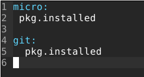

[Etusivu](http://jyrinsan.github.io/palvelintenhallinta/index.html) 
&emsp;[H1](http://jyrinsan.github.io/palvelintenhallinta/h1.html)
&emsp;[H2](http://jyrinsan.github.io/palvelintenhallinta/h2.html)
&emsp;H3
&emsp;[H4](http://jyrinsan.github.io/palvelintenhallinta/h4.html)
&emsp;[H5](http://jyrinsan.github.io/palvelintenhallinta/h5.html)
&emsp;[H6](http://jyrinsan.github.io/palvelintenhallinta/h6.html)
&emsp;[H7](http://jyrinsan.github.io/palvelintenhallinta/h7.html)

# Harjoitus 3 - Versionhallinta

```
Nimi              Sanna Jyrinki
Oppilaitos        Haaga-Helian ammattikorkeakoulu
Kurssi            Palvelinten hallinta ICT4TN022-3015
Opettaja          Tero Karvinen
Tietokoneena      AMD Ryzen 5 PRO 4650U with Radeon Graphics 2.10 GHz
Käyttöjärjestelmä Windows 11 Pro, Versio 21H2
Linux             Oracle Virtual Box 6.1, Debian 11.3
```

## Lähteet

Commonmark contributors. n.a. Markdown Reference. Luettavissa [https://commonmark.org/help/](https://commonmark.org/help/). Luettu 15.4.2022.

## Tehtävä z, lue ja tiivistä

[Commonmark contributors: Markdown Reference](https://commonmark.org/help/)

* Sivulla kuvataan tiivistetysti markdown muotoilun perusteet, joista mielestäni oleellisimmat
  * `# otsikko`, `## pienempi otsikko`
  * `*italic*`, `**bold**` 
  * `[Linkki](http://a.com)`, ``
  * `> Blockquote`, ``Inline code``
  * `* listitem`

## Tehtävä a, MarkDown 

Tämä raportti on tehty MarkDownina. Aloitin raportin teon GitHubin käyttöliittymältä, koska siellä oli Preview toiminto, jonka avulla pystyi saman tien katsomaan miltä tiedosto ulkonäön. Siirryin kuitenkin tekemään raporttia VirtualBoxin Debian-koneelleni ja kirjoittelin raporttia Visual Studio Codella, josta löysin myös Preview toiminnon. Raportilla on käytetty mm. otsikoita, listoja, koodilohkoja, kuvia ja linkkejä. Sivun markdown koodi on täällä https://github.com/jyrinsan/jyrinsan.github.io/blob/master/palvelintenhallinta/h3.md ja raakana markdown koodina siis nähtävissä täällä https://raw.githubusercontent.com/jyrinsan/jyrinsan.github.io/master/palvelintenhallinta/h3.md.

## Tehtävä b, Pull first

Tein muutoksia kahteen tiedostoon h4.md ja h5.md sekä kokonaan uuden tiedoston h6.md. 
* git status näyttää uudet ja muuttuneet tiedostot suhteessa paikalliseen git repositoryyni
* git add lisää tiedostot sellaisiksi, jotka git tunnistaa commitissa, piste perässä tarkoittaa kaikkia tiedostoja ja hakemistoja nykyisessä hakemustossa
* git commit vie lisätyt tiedosto paikalliseen repositoryyni, -m ja sen perässä oleva teksti määrittelee committiin tulevan viestin, jonka on tärkeä olla kuvaava
* git push vie paikalliseen repositoryyn commitoidut muutokset etä repositoryyn eli siis GitHubiin


Hups, huomasin, että unohdin äskeisestä tehdä pullin ennen committia. Pull on hyvä tehdä, jos repositoryyn olisi joku muu ehtinyt viedä tällä välin muutoksia. Vien tähän tiedostoon tässä kirjoittamani muutokset uudelleen GitHubiin, muistaen myös pullin.


## Tehtävä b, Kaikki kirjataan

Kokeilen git log käskyä. Se näyttää kaikki git commitit, uusin ylimpänä. Commiteista näkee tekijän, aikaleiman, commitin id numerosarjan sekä commit viestin.


Kokeilen git diff käskyä. Aluksi se ei näytä mitään. Muokkaan h3.md tiedostoa eli tätä raporttia ja ajan käskyn uudelleen. Git diff näyttää nyt erot paikallisessa tiedostossa suhteessa paikallisen repositoryn tiedostoon. Vihreällä ja + merkillä näkyy lisätyt rivit ja punaisella ja - merkillä poistetut rivit.


Git blame käsky näyttää yksityiskohtaisesti tietyn tiedostojen rivien päivittymisen, eli milloin mikäkin rivi on commitoitu.


## Tehtävä c, Huppis!

Tein "tyhmän muutoksen" kirjoittamalla tämän kohdan c otsikon perään "TYHMÄ MUUTOS". Tein sille 'git add .'. Sen jälkeen resetoin sen ja muutos poistui. 


## Tehtävä d, Formula 


Tein uuden salt tilan appikset, jonka avulla asennan minionille käyttämiäni sovelluksia.

Aloitan luomalla /srv/salt/appikset hakemiston ja sen alle init.sls tiedoston, jolla asennan **micro** sovelluksen:


Micro on jo valmiiksi minulle asennettuna, joten salt ei uudelleen asenna sitä:


Vastaavasti asennan **gitin**, joka myös on valmiiksi koneellani




Testaan vielä, että sovellukset ovat ok asennettu kysymällä niiden versionumerot:


Seuraavaksi asennan **jdk** ympäristön, jotta voin kääntää ja ajaa java-ohjelmia. Jdk:ta minulla ei ole ennestään koneellani, joten ensin kokeilen asentaa sen manuaalisesti:


Teen vielä valmiin Hello world tyyppisen java-ohjelmat appikset kansiooni ja käskytän salttia kopioimaan sen minionilla /var hakemiston alle tehtävään java hakemistoon. Salt myös kääntä ohjelman ja ajaa. 

Tämä tekee java hakemiston:
```
/var/java:
  file.directory
```
Tämä kopioi hakemistoon Hello.java tiedoston, joka löytyy saltin alta appikset hakemistosta:
/var/java/Hello.java:
  file.managed:
    - source: salt://appikset/Hello.java

Käännetään java-ohjelma class-tiedostoksi ajamalla komento:
'javac /var/java/Hello.java':
  cmd.run

Ajetaan java-ohjelma, -cp tarkenteella annetaan luokkapolku/classpath.
'java -cp /var/java Hello':
  cmd.run

Koko salt-tilani on siis lopulta:
 

Ja tässä java-ohjelman kopiointi, kääntäminen ja ajo;


Vaikka ajan salt tilan useita kertoja, java-ohjelman osuudet ajetaan joka kerta, eli ne eivät ole idempotentteja!!!
```

## Tehtävä b, Pull first

Tein muutoksia kahteen tiedostoon h4.md ja h5.md sekä kokonaan uuden tiedoston h6.md. 
* git status näyttää uudet ja muuttuneet tiedostot suhteessa paikalliseen git repositoryyni
* git add lisää tiedostot sellaisiksi, jotka git tunnistaa commitissa, piste perässä tarkoittaa kaikkia tiedostoja ja hakemistoja nykyisessä hakemustossa
* git commit vie lisätyt tiedosto paikalliseen repositoryyni, -m ja sen perässä oleva teksti määrittelee committiin tulevan viestin, jonka on tärkeä olla kuvaava
* git push vie paikalliseen repositoryyn commitoidut muutokset etä repositoryyn eli siis GitHubiin


Hups, huomasin, että unohdin äskeisestä tehdä pullin ennen committia. Pull on hyvä tehdä, jos repositoryyn olisi joku muu ehtinyt viedä tällä välin muutoksia. Vien tähän tiedostoon tässä kirjoittamani muutokset uudelleen GitHubiin, muistaen myös pullin.


## Tehtävä b, Kaikki kirjataan

Kokeilen git log käskyä. Se näyttää kaikki git commitit, uusin ylimpänä. Commiteista näkee tekijän, aikaleiman, commitin id numerosarjan sekä commit viestin.


Kokeilen git diff käskyä. Aluksi se ei näytä mitään. Muokkaan h3.md tiedostoa eli tätä raporttia ja ajan käskyn uudelleen. Git diff näyttää nyt erot paikallisessa tiedostossa suhteessa paikallisen repositoryn tiedostoon. Vihreällä ja + merkillä näkyy lisätyt rivit ja punaisella ja - merkillä poistetut rivit.


Git blame käsky näyttää yksityiskohtaisesti tietyn tiedostojen rivien päivittymisen, eli milloin mikäkin rivi on commitoitu.


## Tehtävä c, Huppis!

Tein "tyhmän muutoksen" kirjoittamalla tämän kohdan c otsikon perään "TYHMÄ MUUTOS". Tein sille 'git add .'. Sen jälkeen resetoin sen ja muutos poistui. 


## Tehtävä d, Formula 


Tein uuden salt tilan appikset, jonka avulla asennan minionille käyttämiäni sovelluksia.

Aloitan luomalla /srv/salt/appikset hakemiston ja sen alle init.sls tiedoston, jolla asennan **micro** sovelluksen:


Micro on jo valmiiksi minulle asennettuna, joten salt ei uudelleen asenna sitä:


Vastaavasti asennan **gitin**, joka myös on valmiiksi koneellani


Testaan vielä, että sovellukset ovat ok asennettu kysymällä niiden versionumerot:


Seuraavaksi asennan **jdk** ympäristön, jotta voin kääntää ja ajaa java-ohjelmia. Jdk:ta minulla ei ole ennestään koneellani, joten ensin kokeilen asentaa sen manuaalisesti:


Teen vielä valmiin Hello world tyyppisen java-ohjelmat appikset kansiooni ja käskytän salttia kopioimaan sen minionilla /var hakemiston alle tehtävään java hakemistoon. Salt myös kääntä ohjelman ja ajaa. 

Tämä tekee java hakemiston:
```
/var/java:
  file.directory
```
Tämä kopioi hakemistoon Hello.java tiedoston, joka löytyy saltin alta appikset hakemistosta:
/var/java/Hello.java:
  file.managed:
    - source: salt://appikset/Hello.java

Käännetään java-ohjelma class-tiedostoksi ajamalla komento:
'javac /var/java/Hello.java':
  cmd.run

Ajetaan java-ohjelma, -cp tarkenteella annetaan luokkapolku/classpath.
'java -cp /var/java Hello':
  cmd.run

Koko salt-tilani on siis lopulta:
 

Ja tässä java-ohjelman kopiointi, kääntäminen ja ajo;


Vaikka ajan salt tilan useita kertoja, java-ohjelman osuudet ajetaan joka kerta, eli ne eivät ole idempotentteja!!!