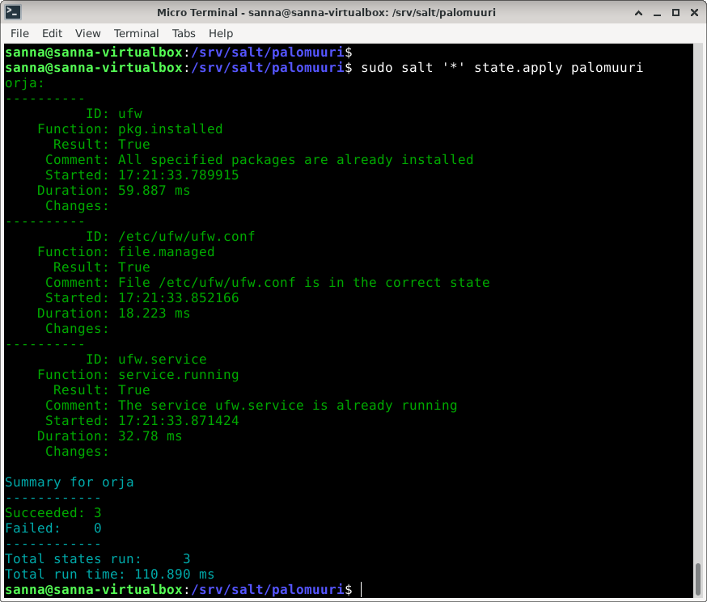

[Etusivu](http://jyrinsan.github.io/palvelintenhallinta/index.html) 
&emsp;[H1](http://jyrinsan.github.io/palvelintenhallinta/h1.html)
&emsp;[H2](http://jyrinsan.github.io/palvelintenhallinta/h2.html)
&emsp;[H3](http://jyrinsan.github.io/palvelintenhallinta/h3.html)
&emsp;H4
&emsp;[H5](http://jyrinsan.github.io/palvelintenhallinta/h5.html)
&emsp;[H6](http://jyrinsan.github.io/palvelintenhallinta/h6.html)
&emsp;[H7](http://jyrinsan.github.io/palvelintenhallinta/h7.html)


# Harjoitus 4 - Aikajana

```
Nimi              Sanna Jyrinki
Oppilaitos        Haaga-Helian ammattikorkeakoulu
Kurssi            Palvelinten hallinta ICT4TN022-3015
Opettaja          Tero Karvinen
Tietokoneena      AMD Ryzen 5 PRO 4650U with Radeon Graphics 2.10 GHz
Käyttöjärjestelmä Windows 11 Pro, Versio 21H2
Linux             Oracle Virtual Box 6.1, Debian 11.3
```

## Tehtävä a, Captain obvious

Asensin seuraavat ohjelmat:
- micro: tekstieditori
- tree: näyttää hakemistorakenteen selkeänä puurakenteena
- git: versionhallinta
- default-jdk: java ympäristö
- thunderbird: sähköpostiohjelma
- vlc: musiikkisoitin
- curl: komentoriviltä kutsu esim. http-rajapintaan, hyödyllinen testauksessa
- gimp: kuvankäsittelyohjelma
- nodejs: react ja nodejs tekniikoilla koodaus
- vim: yksinkertainen legendaarinen editori

Ensin testasin jokaisen ohjelman asennuksen manuaalisesti, esim. 'sudo apt-get -y install micro' ja sitten kirjoitin sls tiedoston /srv/salt/sannanapit/init.sls:

<pre><font color="#55FF55"><b>sanna@sanna-virtualbox</b></font>:<font color="#5555FF"><b>/srv/salt/sannanapit</b></font>$ cat init.sls 
appikset:
  pkg.installed:
    - pkgs:
      - micro
      - git
      - tree
      - default-jdk
      - thunderbird
      - vlc
      - curl
      - gimp
      - nodejs
      - vim
</pre>      

Ennen salt-tilan ajamista poistin sovellukset, esim. 'sudo apt-get purge micro'. Tämän jälkeen ajoin salt-tilan, joka asensi ohjelmat uudelleen:

<pre><font color="#55FF55"><b>sanna@sanna-virtualbox</b></font>:<font color="#5555FF"><b>/srv/salt</b></font>$ sudo salt &apos;*&apos; state.apply sannanapit
<font color="#00AA00">orja:</font>
<font color="#00AAAA">----------</font>
    <font color="#00AAAA">      ID: appikset</font>
    <font color="#00AAAA">Function: pkg.installed</font>
    <font color="#00AAAA">  Result: True</font>
    <font color="#00AAAA"> Comment: 10 targeted packages were installed/updated.</font>
    <font color="#00AAAA"> Started: 10:53:16.613134</font>
    <font color="#00AAAA">Duration: 11269.931 ms</font>
<font color="#00AAAA">     Changes:   </font>
<font color="#00AAAA">              ----------</font>
              <font color="#00AAAA">curl</font>:
                  <font color="#00AAAA">----------</font>
                  <font color="#00AAAA">new</font>:
                      <font color="#00AA00">7.74.0-1.3+deb11u1</font>
                  <font color="#00AAAA">old</font>:
              <font color="#00AAAA">default-jdk</font>:
                  <font color="#00AAAA">----------</font>
                  <font color="#00AAAA">new</font>:
                      <font color="#00AA00">2:1.11-72</font>
                  <font color="#00AAAA">old</font>:
              <font color="#00AAAA">gimp</font>:
                  <font color="#00AAAA">----------</font>
                  <font color="#00AAAA">new</font>:
                      <font color="#00AA00">2.10.22-4</font>
                  <font color="#00AAAA">old</font>:
              <font color="#00AAAA">git</font>:
                  <font color="#00AAAA">----------</font>
                  <font color="#00AAAA">new</font>:
                      <font color="#00AA00">1:2.30.2-1</font>
                  <font color="#00AAAA">old</font>:
              <font color="#00AAAA">micro</font>:
                  <font color="#00AAAA">----------</font>
                  <font color="#00AAAA">new</font>:
                      <font color="#00AA00">2.0.8-1+b6</font>
                  <font color="#00AAAA">old</font>:
              <font color="#00AAAA">nodejs</font>:
                  <font color="#00AAAA">----------</font>
                  <font color="#00AAAA">new</font>:
                      <font color="#00AA00">12.22.5~dfsg-2~11u1</font>
                  <font color="#00AAAA">old</font>:
              <font color="#00AAAA">thunderbird</font>:
                  <font color="#00AAAA">----------</font>
                  <font color="#00AAAA">new</font>:
                      <font color="#00AA00">1:91.8.0-1~deb11u1</font>
                  <font color="#00AAAA">old</font>:
              <font color="#00AAAA">tree</font>:
                  <font color="#00AAAA">----------</font>
                  <font color="#00AAAA">new</font>:
                      <font color="#00AA00">1.8.0-1+b1</font>
                  <font color="#00AAAA">old</font>:
              <font color="#00AAAA">vim</font>:
                  <font color="#00AAAA">----------</font>
                  <font color="#00AAAA">new</font>:
                      <font color="#00AA00">2:8.2.2434-3+deb11u1</font>
                  <font color="#00AAAA">old</font>:
              <font color="#00AAAA">vlc</font>:
                  <font color="#00AAAA">----------</font>
                  <font color="#00AAAA">new</font>:
                      <font color="#00AA00">3.0.16-1</font>
                  <font color="#00AAAA">old</font>:

<font color="#00AAAA">Summary for orja</font>
<font color="#00AAAA">------------</font>
<font color="#00AA00">Succeeded: 1</font> (<font color="#00AA00">changed=1</font>)
<font color="#00AAAA">Failed:    0</font>
<font color="#00AAAA">------------</font>
<font color="#00AAAA">Total states run:     1</font>
<font color="#00AAAA">Total run time:  11.270 s</font>
</pre>

Testasin ohjelmia, esimerkiksi gimp:


## Tehtävä b, CSI Pasila

Siirryn roottina /etc hakemistoon (sudo -i, cd /etc) ja annan siellä tehtävänannossa annetun käskyn ja saan aikajanan

<pre>root@sanna-virtualbox:/etc# sudo find -printf &apos;%T+ %p\n&apos; |sort |tail
2022-04-23+11:02:35.3921973330 ./alternatives/ex.1.gz
2022-04-23+11:02:35.3921973330 ./alternatives/ex.da.1.gz
2022-04-23+11:02:35.3921973330 ./alternatives/ex.de.1.gz
2022-04-23+11:02:35.3921973330 ./alternatives/ex.fr.1.gz
2022-04-23+11:02:35.3921973330 ./alternatives/ex.it.1.gz
2022-04-23+11:02:35.3921973330 ./alternatives/ex.ja.1.gz
2022-04-23+11:02:35.3921973330 ./alternatives/ex.pl.1.gz
2022-04-23+11:02:35.3921973330 ./alternatives/ex.ru.1.gz
2022-04-23+11:02:35.3961993320 ./alternatives/rview
2022-04-23+11:02:35.4002013330 ./alternatives
</pre>

Pelkkä find tulostaa ko, hakemistossa olevan tiedostot. Käskyn find manuaalista (man find) selviää lisää:
- -printf:  muotoilee findin tulostaman datan lisämääreiden avulla
- %T on tiedoston viimeisin muokkausaika
- \+ ajan esitysmuoto, jossa päivä ja aika on erotettu + merkillä, esim. 2004-04-28+22:22:05.0
- %p tiedoston nimi 
- \n rivinvaihto

Varsinaisen find käskyn perässä on 2 putkitusta, eli find käskyn tulos putkitetaan sort ohjelmalle, joka järjestää rivit järjestykseen. Sen jälkeen tulos putkitetaan tail ohjelmalle, selvitän mitä se tekee. Tutkailen sort käskyn manuaalia (man sort), esim laittamalla perään -r, saan uusimmat rivit ylös. Toinen putkitus on tail ohjelmalle, man tail kertoo, ett se tulostaa vain viimeisimmät rivit, sitäkin voin säätää tarvittaessa esim. laittamalla perään -n 20 tulostetaan 20 riviä. Tässä tehtävässä ei kuitenkaan haluta muuttaa oletuksia, koska on tarve tarkkailla tulosteen lopussa nimenomaan uusimpia muokkauksia ja oletusrivimäärä riittänee.

Yritän muuttaa aikajanaa. Deletoin seuraavasti aimmin tunnilla /etc/skel alle laitetut micron asetukset. Nyt aikajanan lopussa näkyy muutos /ect/skel/.config/micro hakemistoon. Muutos ei koske muita hakemistoja/tiedostoja, joten näkyy vain yksi rivija aikaleima vastaa tätä aikaa:

<pre>root@sanna-virtualbox:/etc# rm skel/.config/micro/settings.json 
root@sanna-virtualbox:/etc# find -printf &apos;%T+ %p\n&apos; |sort |tail
2022-04-23+11:02:35.3921973330 ./alternatives/ex.fr.1.gz
2022-04-23+11:02:35.3921973330 ./alternatives/ex.it.1.gz
2022-04-23+11:02:35.3921973330 ./alternatives/ex.ja.1.gz
2022-04-23+11:02:35.3921973330 ./alternatives/ex.pl.1.gz
2022-04-23+11:02:35.3921973330 ./alternatives/ex.ru.1.gz
2022-04-23+11:02:35.3961993320 ./alternatives/rview
2022-04-23+11:02:35.4002013330 ./alternatives
2022-04-23+12:16:50.3478877980 ./shadow
2022-04-23+12:16:50.3878877970 .
2022-04-23+12:24:25.0358774430 ./skel/.config/micro
</pre>

Restarttasin virtuaalikoneeni uudelleen ja kirjauduin uudelleen koneelleni ja ajoin aikajanan uudelleen ja oli tapahtunut enemmän muutoksia, jotka liittyvän debianin käynnistymiseen.

<pre>root@sanna-virtualbox:/etc# find -printf &apos;%T+ %p\n&apos; |sort |tail -n 20
2022-04-23+11:02:35.3921973330 ./alternatives/ex.de.1.gz
2022-04-23+11:02:35.3921973330 ./alternatives/ex.fr.1.gz
2022-04-23+11:02:35.3921973330 ./alternatives/ex.it.1.gz
2022-04-23+11:02:35.3921973330 ./alternatives/ex.ja.1.gz
2022-04-23+11:02:35.3921973330 ./alternatives/ex.pl.1.gz
2022-04-23+11:02:35.3921973330 ./alternatives/ex.ru.1.gz
2022-04-23+11:02:35.3961993320 ./alternatives/rview
2022-04-23+11:02:35.4002013330 ./alternatives
2022-04-23+12:16:50.3478877980 ./shadow
2022-04-23+12:24:25.0358774430 ./skel/.config/micro
2022-04-23+12:31:27.3359999120 ./resolv.conf
2022-04-23+12:31:27.3399999120 .
2022-04-23+12:31:34.6599997450 ./udev/rules.d/60-vboxadd.rules
2022-04-23+12:31:34.7199997440 ./kernel/postinst.d/vboxadd
2022-04-23+12:31:34.7319997440 ./kernel/prerm.d/vboxadd
2022-04-23+12:31:36.1159997120 ./xdg/autostart
2022-04-23+12:31:36.1199997120 ./xdg/autostart/vboxclient.desktop
2022-04-23+12:31:36.1399997120 ./X11/Xsession.d
2022-04-23+12:31:36.1399997120 ./X11/Xsession.d/98vboxadd-xclient
2022-04-23+12:31:37.7323628710 ./salt/minion.d/_schedule.conf
</pre>


## Tehtävä c, Tiedän mitä teit viime kesän^H^H^H komennolla

Asensin palomuurin ja aktivoin sen
```
sudo apt-get -y install ufw
sudo ufw enable
```

Muutokset näkyvät aikajanalla
<pre><font color="#55FF55"><b>sanna@sanna-virtualbox</b></font>:<font color="#5555FF"><b>~</b></font>$ cd /etc; find -printf &apos;%T+ %p\n&apos; |sort |tail
find: ‘./polkit-1/localauthority’: Permission denied
find: ‘./ssl/private’: Permission denied
2022-04-23+16:40:53.3100381590 ./ufw
2022-04-23+16:40:53.4981321550 ./rc1.d
2022-04-23+16:40:53.4981321550 ./rc1.d/K01ufw
2022-04-23+16:40:53.4981321550 ./rcS.d
2022-04-23+16:40:53.4981321550 ./rcS.d/S01ufw
2022-04-23+16:40:53.8463061470 ./systemd/system/multi-user.target.wants
2022-04-23+16:40:53.8463061470 ./systemd/system/multi-user.target.wants/ufw.service
2022-04-23+16:48:43.9452274690 ./ufw/ufw.conf
2022-04-23+16:48:44.0812954640 ./ufw/user6.rules
2022-04-23+16:48:44.0812954640 ./ufw/user.rules
</pre>

Palomuuri on demoni ja katsotaan sen tila
<pre><font color="#55FF55"><b>sanna@sanna-virtualbox</b></font>:<font color="#5555FF"><b>/etc</b></font>$ sudo systemctl status ufw
<font color="#55FF55"><b>●</b></font> ufw.service - Uncomplicated firewall
     Loaded: loaded (/lib/systemd/system/ufw.service; enabled; vendor preset: e<span style="background-color:#FFFFFF"><font color="#000000">&gt;</font></span>
     Active: <font color="#55FF55"><b>active (exited)</b></font> since Sat 2022-04-23 16:33:42 EEST; 18min ago
       Docs: man:ufw(8)
   Main PID: 312 (code=exited, status=0/SUCCESS)
      Tasks: 0 (limit: 4505)
     Memory: 0B
        CPU: 0
     CGroup: /system.slice/ufw.service

huhti 23 16:33:42 sanna-virtualbox systemd[1]: Finished Uncomplicated firewall.
Warning: journal has been rotated since unit was started, output may be incompl<span style="background-color:#FFFFFF"><font color="#000000">&gt;</font></span>
</pre>

Teen seuraavaksi saltilla tilan /srv/salt/palomuuri/init.sls, joka asentaa ufw palomuurin ja aktivoi sen. Kopioin palomuuri-hakemistoon myös /etc/ufw/ufw.conf konfigurointitiedoston, jossa enabled=true. Ufw laitetaan tarkkailemaan konfigurointitiedostoa ja restarttaa demonin kun se eroaa /etc hakemiston alla olevasta..

Salt tila on seuraava:
```
sanna@sanna-virtualbox:/srv/salt/palomuuri$ cat init.sls 
ufw:
  pkg.installed

/etc/ufw/ufw.conf:
  file.managed:
    - source: salt://palomuuri/ufw.conf

ufw.service:
  service.running:
    - watch:
      - file: /etc/ufw/ufw.conf
```

Ajan salt-tilan


Disabloin manuaalisesti palomuurin, joka muuttaa konfigurointitiedostoa. Ajamalla salt-tilan, sekä konfigurointitiedosto kopioituu ja demoni käynnistyy uudelleen:

<pre><font color="#55FF55"><b>sanna@sanna-virtualbox</b></font>:<font color="#5555FF"><b>/srv/salt/ssh</b></font>$ sudo salt &apos;*&apos; state.apply palomuuri
<font color="#00AA00">orja:</font>
<font color="#00AA00">----------</font>
    <font color="#00AA00">      ID: ufw</font>
    <font color="#00AA00">Function: pkg.installed</font>
    <font color="#00AA00">  Result: True</font>
    <font color="#00AA00"> Comment: All specified packages are already installed</font>
    <font color="#00AA00"> Started: 17:27:32.685407</font>
    <font color="#00AA00">Duration: 76.963 ms</font>
<font color="#00AA00">     Changes:   </font>
<font color="#00AAAA">----------</font>
    <font color="#00AAAA">      ID: /etc/ufw/ufw.conf</font>
    <font color="#00AAAA">Function: file.managed</font>
    <font color="#00AAAA">  Result: True</font>
    <font color="#00AAAA"> Comment: File /etc/ufw/ufw.conf updated</font>
    <font color="#00AAAA"> Started: 17:27:32.764676</font>
    <font color="#00AAAA">Duration: 38.562 ms</font>
<font color="#00AAAA">     Changes:   </font>
<font color="#00AAAA">              ----------</font>
              <font color="#00AAAA">diff</font>:
                  <font color="#00AA00">--- </font>
                  <font color="#00AA00">+++ </font>
                  <font color="#00AA00">@@ -3,7 +3,7 @@</font>
                  <font color="#00AA00"> </font>
                  <font color="#00AA00"> # Set to yes to start on boot. If setting this remotely, be sure to add a rule</font>
                  <font color="#00AA00"> # to allow your remote connection before starting ufw. Eg: &apos;ufw allow 22/tcp&apos;</font>
                  <font color="#00AA00">-ENABLED=no</font>
                  <font color="#00AA00">+ENABLED=yes</font>
                  <font color="#00AA00"> </font>
                  <font color="#00AA00"> # Please use the &apos;ufw&apos; command to set the loglevel. Eg: &apos;ufw logging medium&apos;.</font>
                  <font color="#00AA00"> # See &apos;man ufw&apos; for details.</font>
<font color="#00AAAA">----------</font>
    <font color="#00AAAA">      ID: ufw.service</font>
    <font color="#00AAAA">Function: service.running</font>
    <font color="#00AAAA">  Result: True</font>
    <font color="#00AAAA"> Comment: Service restarted</font>
    <font color="#00AAAA"> Started: 17:27:32.947716</font>
    <font color="#00AAAA">Duration: 621.24 ms</font>
<font color="#00AAAA">     Changes:   </font>
<font color="#00AAAA">              ----------</font>
              <font color="#00AAAA">ufw.service</font>:
                  <font color="#FFFF55"><b>True</b></font>

<font color="#00AAAA">Summary for orja</font>
<font color="#00AAAA">------------</font>
<font color="#00AA00">Succeeded: 3</font> (<font color="#00AA00">changed=2</font>)
<font color="#00AAAA">Failed:    0</font>
<font color="#00AAAA">------------</font>
<font color="#00AAAA">Total states run:     3</font>
<font color="#00AAAA">Total run time: 736.765 ms</font>
</pre>

Stoppaan ufw demonin ja ajan salt-tilan, silloin pelkästään demoni käynnistyy:

<pre><font color="#55FF55"><b>sanna@sanna-virtualbox</b></font>:<font color="#5555FF"><b>/srv/salt/ssh</b></font>$ sudo salt &apos;*&apos; state.apply palomuuri
<font color="#00AA00">orja:</font>
<font color="#00AA00">----------</font>
    <font color="#00AA00">      ID: ufw</font>
    <font color="#00AA00">Function: pkg.installed</font>
    <font color="#00AA00">  Result: True</font>
    <font color="#00AA00"> Comment: All specified packages are already installed</font>
    <font color="#00AA00"> Started: 17:28:39.297829</font>
    <font color="#00AA00">Duration: 60.755 ms</font>
<font color="#00AA00">     Changes:   </font>
<font color="#00AA00">----------</font>
    <font color="#00AA00">      ID: /etc/ufw/ufw.conf</font>
    <font color="#00AA00">Function: file.managed</font>
    <font color="#00AA00">  Result: True</font>
    <font color="#00AA00"> Comment: File /etc/ufw/ufw.conf is in the correct state</font>
    <font color="#00AA00"> Started: 17:28:39.360898</font>
    <font color="#00AA00">Duration: 17.111 ms</font>
<font color="#00AA00">     Changes:   </font>
<font color="#00AAAA">----------</font>
    <font color="#00AAAA">      ID: ufw.service</font>
    <font color="#00AAAA">Function: service.running</font>
    <font color="#00AAAA">  Result: True</font>
    <font color="#00AAAA"> Comment: Started Service ufw.service</font>
    <font color="#00AAAA"> Started: 17:28:39.378999</font>
    <font color="#00AAAA">Duration: 183.304 ms</font>
<font color="#00AAAA">     Changes:   </font>
<font color="#00AAAA">              ----------</font>
              <font color="#00AAAA">ufw.service</font>:
                  <font color="#FFFF55"><b>True</b></font>

<font color="#00AAAA">Summary for orja</font>
<font color="#00AAAA">------------</font>
<font color="#00AA00">Succeeded: 3</font> (<font color="#00AA00">changed=1</font>)
<font color="#00AAAA">Failed:    0</font>
<font color="#00AAAA">------------</font>
<font color="#00AAAA">Total states run:     3</font>
<font color="#00AAAA">Total run time: 261.170 ms</font>
</pre>

## Tehtävä d, Asenna jokin toinen ohjelma asetuksineen

Vinkki: tässäkin kohdassa edellytetään asetusten muuttamista. Jos haluat, voit valita erilaisen ohjelman kuin c-kohdassa. Esimerkiksi jos asensit c-kohdassa demonin, voit asentaa tässä komentoriviohjelman tai graafisen käyttöliittymän ohjelman.