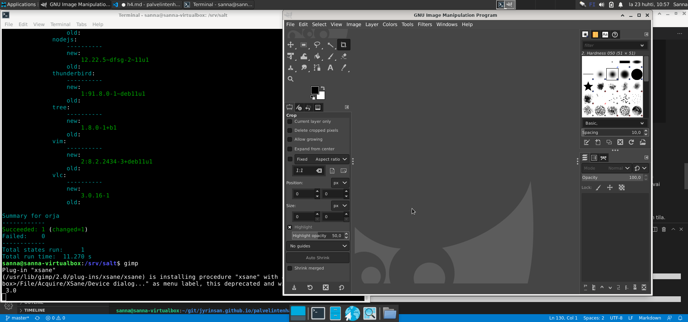

[Etusivu](http://jyrinsan.github.io/palvelintenhallinta/index.html) 
&emsp;[H1](http://jyrinsan.github.io/palvelintenhallinta/h1.html)
&emsp;[H2](http://jyrinsan.github.io/palvelintenhallinta/h2.html)
&emsp;[H3](http://jyrinsan.github.io/palvelintenhallinta/h3.html)
&emsp;H4
&emsp;[H5](http://jyrinsan.github.io/palvelintenhallinta/h5.html)
&emsp;[H6](http://jyrinsan.github.io/palvelintenhallinta/h6.html)
&emsp;[H7](http://jyrinsan.github.io/palvelintenhallinta/h7.html)


# Harjoitus 4 - Aikajana

```
Nimi              Sanna Jyrinki
Oppilaitos        Haaga-Helian ammattikorkeakoulu
Kurssi            Palvelinten hallinta ICT4TN022-3015
Opettaja          Tero Karvinen
Tietokoneena      AMD Ryzen 5 PRO 4650U with Radeon Graphics 2.10 GHz
Käyttöjärjestelmä Windows 11 Pro, Versio 21H2
Linux             Oracle Virtual Box 6.1, Debian 11.3
```

## Tehtävä a, Captain obvious

Asensin seuraavat ohjelmat:
- micro: tekstieditori
- gedit: tekstieditori
- tree: näyttää hakemistorakenteen selkeänä puurakenteena
- git: versionhallinta
- default-jdk: java ynpäristöstö
- thunderbird: sähköpostiohjelma
- vlc: musiikkisoitin
- curl: komentoriviltä kutsu esim. http-rajapintaan, hyödyllinen testauksessa
- gimp, grafiikkaohjelma
- nodejs, react ja nodejs tekniikoilla koodaus
- vim, yksinkertainen legendaarinen editori

Ensin testasin jokaisen ohjelman asennuksen manuaalisesti, esim. 'sudo apt-get -y install micro' ja sitten kirjoitin sls tiedoston /srv/salt/sannanapit/init.sls:

<pre><font color="#55FF55"><b>sanna@sanna-virtualbox</b></font>:<font color="#5555FF"><b>/srv/salt/sannanapit</b></font>$ cat init.sls 
appikset:
  pkg.installed:
    - pkgs:
      - micro
      - git
      - tree
      - default-jdk
      - thunderbird
      - vlc
      - curl
      - gimp
      - nodejs
      - vim
</pre>      

Ennen salt-tilan ajamista poistin sovellukset, esim. 'sudo apt-get purge micro'. Tämän jälkeen ajoin salt-tilan, joka asensi ohjelmat uudelleen:

<pre><font color="#55FF55"><b>sanna@sanna-virtualbox</b></font>:<font color="#5555FF"><b>/srv/salt</b></font>$ sudo salt &apos;*&apos; state.apply sannanapit
<font color="#00AA00">orja:</font>
<font color="#00AAAA">----------</font>
    <font color="#00AAAA">      ID: appikset</font>
    <font color="#00AAAA">Function: pkg.installed</font>
    <font color="#00AAAA">  Result: True</font>
    <font color="#00AAAA"> Comment: 10 targeted packages were installed/updated.</font>
    <font color="#00AAAA"> Started: 10:53:16.613134</font>
    <font color="#00AAAA">Duration: 11269.931 ms</font>
<font color="#00AAAA">     Changes:   </font>
<font color="#00AAAA">              ----------</font>
              <font color="#00AAAA">curl</font>:
                  <font color="#00AAAA">----------</font>
                  <font color="#00AAAA">new</font>:
                      <font color="#00AA00">7.74.0-1.3+deb11u1</font>
                  <font color="#00AAAA">old</font>:
              <font color="#00AAAA">default-jdk</font>:
                  <font color="#00AAAA">----------</font>
                  <font color="#00AAAA">new</font>:
                      <font color="#00AA00">2:1.11-72</font>
                  <font color="#00AAAA">old</font>:
              <font color="#00AAAA">gimp</font>:
                  <font color="#00AAAA">----------</font>
                  <font color="#00AAAA">new</font>:
                      <font color="#00AA00">2.10.22-4</font>
                  <font color="#00AAAA">old</font>:
              <font color="#00AAAA">git</font>:
                  <font color="#00AAAA">----------</font>
                  <font color="#00AAAA">new</font>:
                      <font color="#00AA00">1:2.30.2-1</font>
                  <font color="#00AAAA">old</font>:
              <font color="#00AAAA">micro</font>:
                  <font color="#00AAAA">----------</font>
                  <font color="#00AAAA">new</font>:
                      <font color="#00AA00">2.0.8-1+b6</font>
                  <font color="#00AAAA">old</font>:
              <font color="#00AAAA">nodejs</font>:
                  <font color="#00AAAA">----------</font>
                  <font color="#00AAAA">new</font>:
                      <font color="#00AA00">12.22.5~dfsg-2~11u1</font>
                  <font color="#00AAAA">old</font>:
              <font color="#00AAAA">thunderbird</font>:
                  <font color="#00AAAA">----------</font>
                  <font color="#00AAAA">new</font>:
                      <font color="#00AA00">1:91.8.0-1~deb11u1</font>
                  <font color="#00AAAA">old</font>:
              <font color="#00AAAA">tree</font>:
                  <font color="#00AAAA">----------</font>
                  <font color="#00AAAA">new</font>:
                      <font color="#00AA00">1.8.0-1+b1</font>
                  <font color="#00AAAA">old</font>:
              <font color="#00AAAA">vim</font>:
                  <font color="#00AAAA">----------</font>
                  <font color="#00AAAA">new</font>:
                      <font color="#00AA00">2:8.2.2434-3+deb11u1</font>
                  <font color="#00AAAA">old</font>:
              <font color="#00AAAA">vlc</font>:
                  <font color="#00AAAA">----------</font>
                  <font color="#00AAAA">new</font>:
                      <font color="#00AA00">3.0.16-1</font>
                  <font color="#00AAAA">old</font>:

<font color="#00AAAA">Summary for orja</font>
<font color="#00AAAA">------------</font>
<font color="#00AA00">Succeeded: 1</font> (<font color="#00AA00">changed=1</font>)
<font color="#00AAAA">Failed:    0</font>
<font color="#00AAAA">------------</font>
<font color="#00AAAA">Total states run:     1</font>
<font color="#00AAAA">Total run time:  11.270 s</font>
</pre>

Testasin ohjelmia, esimerkiksi gimp:


## Tehtävä b, CSI Pasila

<<<<<<< HEAD
Siirryn roottina /etc hakemistoon (sudo -i), cd /etc) ja annan siellä tehtävänannossa annetun käskyn ja saan aikajanan

<pre>root@sanna-virtualbox:/etc# sudo find -printf &apos;%T+ %p\n&apos; |sort |tail
2022-04-23+11:02:35.3921973330 ./alternatives/ex.1.gz
2022-04-23+11:02:35.3921973330 ./alternatives/ex.da.1.gz
2022-04-23+11:02:35.3921973330 ./alternatives/ex.de.1.gz
2022-04-23+11:02:35.3921973330 ./alternatives/ex.fr.1.gz
2022-04-23+11:02:35.3921973330 ./alternatives/ex.it.1.gz
2022-04-23+11:02:35.3921973330 ./alternatives/ex.ja.1.gz
2022-04-23+11:02:35.3921973330 ./alternatives/ex.pl.1.gz
2022-04-23+11:02:35.3921973330 ./alternatives/ex.ru.1.gz
2022-04-23+11:02:35.3961993320 ./alternatives/rview
2022-04-23+11:02:35.4002013330 ./alternatives
</pre>

Pelkkä find tulostaa ko, hakemistossa olevan tiedostot. Käskyn find manuaalista (man find) selviää lisää:
- -printf:  muotoilee findin tulostaman datan lisämääreiden avulla
- %T on tiedoston viimeisin muokkausaika
- + ajan esitysmuoto, jossa päivä ja aika on erotettu + merkillä, esim. 2004-04-28+22:22:05.0
- %p tiedoston nimi 
- \n rivinvaihto

Varsinaisen find käskyn perässä on 2 putkitusta, elin find käskyn tulos putkitetaan sort ohjelmalle, joka järjestää rivit järjestykseen. Tutkailen sort käskyn manuaalia (man sort), esim laittamalla perään -r, saan uusimmat rivit ylös. Toinen putkitus on tail ohjelmalle, joka tulostaa vain viimeisimmät rivit, sitäkin voin säätää tarvittaessa esim. laittamalla perään -n 20 tulostetaan 20 riviä. Tässä tehtävässä ei kuitenkaan haluta muuttaa oletuksia, koska on tarve tarkkailla tulosteen lopussa nimenomaan uusimpia muokkauksia ja oletusrivimäärä riittänee.

aaaa

## Tehtävä c, Tiedän mitä teit viime kesän^H^H^H komennolla

Säädä jotain ohjelmaa ja etsi sen muuttamat tiedostot aikajanasta. Tee sitten tästä oma Saltin tila.

Vinkki: tässä kohdassa pitää muuttaa jonkin ohjelman asetuksia, pelkkä ohjelman asennus pkg.installed on liian helppoa.

## Tehtävä d, Asenna jokin toinen ohjelma asetuksineen

Vinkki: tässäkin kohdassa edellytetään asetusten muuttamista. Jos haluat, voit valita erilaisen ohjelman kuin c-kohdassa. Esimerkiksi jos asensit c-kohdassa demonin, voit asentaa tässä komentoriviohjelman tai graafisen käyttöliittymän ohjelman.