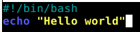
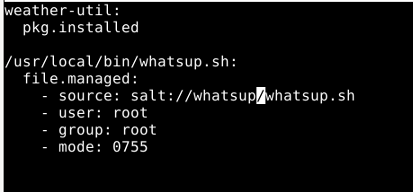

[Etusivu](index.html) 
&emsp;[H1](h1.html)
&emsp;[H2](h2.html)
&emsp;[H3](h3.html)
&emsp;[H4](h4.html)
&emsp;H5
&emsp;[H6](h6.html)
&emsp;[H7](h7.html)

# Harjoitus 5 - Uusi komento

```
Nimi              Sanna Jyrinki
Oppilaitos        Haaga-Helian ammattikorkeakoulu
Kurssi            Palvelinten hallinta ICT4TN022-3015
Opettaja          Tero Karvinen
Tietokoneena      AMD Ryzen 5 PRO 4650U with Radeon Graphics 2.10 GHz
Käyttöjärjestelmä Windows 11 Pro, Versio 21H2
Linux             Oracle Virtual Box 6.1, Debian 11.3
```

## Lähteet

Arora, H. 2014. How to Access Weather Forecasts from Linux Command Line. Luettavissa [https://www.maketecheasier.com/access-weather-forecasts-linux-command-line/#:~:text=Users%20of%20a%20Debian-based%20Linux%20distribution%20like%20Ubuntu,also%20download%20its%20source%20and%20install%20it%20manually.?msclkid=f4af4dcfc7e011ec840858928e5b1962](https://www.maketecheasier.com/access-weather-forecasts-linux-command-line/#:~:text=Users%20of%20a%20Debian-based%20Linux%20distribution%20like%20Ubuntu,also%20download%20its%20source%20and%20install%20it%20manually.?msclkid=f4af4dcfc7e011ec840858928e5b1962). Luettu 30.4.2022.

Jyrinki, S. 2022a. Harjoitus H1 - Linux asennus VirtualBoxiin, Tehtävä a, Linuxin asennus VirtulBoxiin. Luettavissa [https://jyrinsan.github.io/h1.html](https://jyrinsan.github.io/h1.html). Luettu 29.4.2022.

Jyrinki, S. 2022b. Harjoitus H1 - Hei maailma & monet tilat, Tehtävä f, Herra ja orja. Luettavissa [https://jyrinsan.github.io/palvelintenhallinta/h1.html#f](https://jyrinsan.github.io/palvelintenhallinta/h1.html#f). Luettu 29.4.2022.

## Alkutoimet

Asensin tämän harjoituksen alkuun, virtualboxiini kokonaan uuden Debian 11 virtuaalikoneen ja aloitin homman taas puhtaalta pöydältä. Asennuksen muistin jo ulkoa, mutta ohje löytyy [Linux palvelimet kurssin harjoituksesta 1](../h1.html). Tästä saa rutiinia ja toisaalta koneeni oli jo melko täynnä saltin tiloja ja asennettuja ohjelmia, joten oli helpompi luoda kokonaan uusi virtuaalikone.

Asensin uudelle virtuualikoneelleni sekä herran, että orjan, kuten tein [harjoituksen h1 tehtävässä f](https://jyrinsan.github.io/palvelintenhallinta/h1.html#f).

## Tehtävä a, Hei komento!

Teen shell-skriptin, joka tulostaa "hei maailma". Ensin teen skriptin omaan kotihakemistooni:



Testasin toimiiko
<pre><font color="#55FF55"><b>sanna@sanna-virtualbox</b></font>:<font color="#5555FF"><b>~</b></font>$bash heimaailma.sh 
Hello world
</pre>

Ilman bash käskyä ei toimi, koska ei ole riittävästi oikeuksia:
<pre><font color="#55FF55"><b>sanna@sanna-virtualbox</b></font>:<font color="#5555FF"><b>~</b></font>$ ./heimaailma.sh
bash: ./heimaailma.sh: Permission denied
<font color="#55FF55"><b>sanna@sanna-virtualbox</b></font>:<font color="#5555FF"><b>~</b></font>$ ls -l
-rw-r--r-- 1 sanna sanna   31 28. 4. 21:33 heimaailma.sh
</pre>

Lisätään kaikille suoritus (x) oikeudet ja testataan, nyt käsky toimii suoraan. Oikeuksien säädössä u=user, g=group ja o=other eli kaikki. Saltin tapauksessa user ja group orjalla on root.
<pre><font color="#55FF55"><b>sanna@sanna-virtualbox</b></font>:<font color="#5555FF"><b>~</b></font>$ chmod ugo+x heimaailma.sh 
<font color="#55FF55"><b>sanna@sanna-virtualbox</b></font>:<font color="#5555FF"><b>~</b></font>$ ./heimaailma.sh 
Hello world
</pre>

Siirretään komento kaikkien käyttäjien kutsuttavaksi mistä vaan hakemistosta hakemistoon /usr/local/bin ja testataan omassa kotihakemistossa:
<pre><font color="#55FF55"><b>sanna@sanna-virtualbox</b></font>:<font color="#5555FF"><b>~</b></font>$ sudo cp heimaailma.sh /usr/local/bin/
<font color="#55FF55"><b>sanna@sanna-virtualbox</b></font>:<font color="#5555FF"><b>~</b></font>$ pwd
/home/sanna
<font color="#55FF55"><b>sanna@sanna-virtualbox</b></font>:<font color="#5555FF"><b>~</b></font>$ heimaailma.sh
Hello world
</pre>

Nyt automatisoidaan saltille, tehdään /srv/salt/heimaailma/init.sls tiedosto, joka tallentaa tiedoston. Ohjetta katsoin käskyllä 'salt-call --local sys.state_doc file.managed'. Saltin orjilla user ja group on root. Oikeus 0755 säätää userille kaikki oikeudet (2=read + 3=execute + 3=write), kun taas ryhmälle ja muille vain read ja execute oikeudet.

<pre>usr/local/bin/heimaailma.sh:
  file.managed:
    - source: salt://heimaailma/heimaailma.sh
    - user: root
    - group: root
    - mode: 0755
</pre>

Ennen kuin ajoin tilan saltilla, kopioin tiedoston saltin alle `sudo cp /usr/local/bin/heimaailma.sh /srv/salt/heimaailma/` ja deletoin tiedoston `sudo rm /usr/local/bin/heimaailma.sh`, jotta salt asentaa tiedoston uudelleen. Deletoin skriptin myös omassa kotihakemustossani `rm /home/sanna/heimaailma.sh`

Ajetaan
<pre><font color="#55FF55"><b>sanna@sanna-virtualbox</b></font>:<font color="#5555FF"><b>/srv/salt/heimaailma</b></font>$ sudo salt &apos;*&apos; state.apply heimaailma
<font color="#00AA00">sannanorja:</font>
<font color="#00AAAA">----------</font>
    <font color="#00AAAA">      ID: /usr/local/bin/heimaailma.sh</font>
    <font color="#00AAAA">Function: file.managed</font>
    <font color="#00AAAA">  Result: True</font>
    <font color="#00AAAA"> Comment: File /usr/local/bin/heimaailma.sh updated</font>
    <font color="#00AAAA"> Started: 23:33:07.854036</font>
    <font color="#00AAAA">Duration: 22.623 ms</font>
<font color="#00AAAA">     Changes:   </font>
<font color="#00AAAA">              ----------</font>
              <font color="#00AAAA">diff</font>:
                  <font color="#00AA00">New file</font>
              <font color="#00AAAA">mode</font>:
                  <font color="#00AA00">0755</font>

<font color="#00AAAA">Summary for sannanorja</font>
<font color="#00AAAA">------------</font>
<font color="#00AA00">Succeeded: 1</font> (<font color="#00AA00">changed=1</font>)
<font color="#00AAAA">Failed:    0</font>
<font color="#00AAAA">------------</font>
<font color="#00AAAA">Total states run:     1</font>
<font color="#00AAAA">Total run time:  22.623 ms</font>
</pre>

Menen testaamaan nyt saltin asentamaa tiedostoa ja katsomaan syntyikö oikeudet oikein:
<pre><font color="#55FF55"><b>sanna@sanna-virtualbox</b></font>:<font color="#5555FF"><b>~</b></font>$ cd
<font color="#55FF55"><b>sanna@sanna-virtualbox</b></font>:<font color="#5555FF"><b>~</b></font>$ heimaailma.sh
Hello world
<font color="#55FF55"><b>sanna@sanna-virtualbox</b></font>:<font color="#5555FF"><b>~</b></font>$ ls -l /usr/local/bin/heimaailma.sh 
-rwxr-xr-x 1 root root 31 29. 4. 18:40 <font color="#55FF55"><b>/usr/local/bin/heimaailma.sh</b></font>
<font color="#55FF55"><b>sanna@sanna-virtualbox</b></font>:<font color="#5555FF"><b>~</b></font>$ 
</pre>

Skripti toimii ja kaikilla käyttäjillä on aivan oikein x eli execute eli suoritusoikeudet.

## Tehtävä b, whatsup.sh

Sään saan selville weather komennolla, löysin ohjeen [täältä](https://www.maketecheasier.com/access-weather-forecasts-linux-command-line/#:~:text=Users%20of%20a%20Debian-based%20Linux%20distribution%20like%20Ubuntu,also%20download%20its%20source%20and%20install%20it%20manually.?msclkid=f4af4dcfc7e011ec840858928e5b1962)

Asennan ensin manuaalisesti
`sudo apt-get -y install weather-util`

Teen salt-tilan, joka asentaa sovelluksen
<pre>weather-util:
  pkg.installed
</pre>

Ajan salt-tilan
<pre><font color="#55FF55"><b>sanna@sanna-virtualbox</b></font>:<font color="#5555FF"><b>/srv/salt/whatsup</b></font>$ sudo salt &apos;*&apos; state.apply whatsup
<font color="#00AA00">sannanorja:</font>
<font color="#00AA00">----------</font>
    <font color="#00AA00">      ID: weather-util</font>
    <font color="#00AA00">Function: pkg.installed</font>
    <font color="#00AA00">  Result: True</font>
    <font color="#00AA00"> Comment: All specified packages are already installed</font>
    <font color="#00AA00"> Started: 20:31:05.719305</font>
    <font color="#00AA00">Duration: 63.668 ms</font>
<font color="#00AA00">     Changes:   </font>

<font color="#00AAAA">Summary for sannanorja</font>
<font color="#00AAAA">------------</font>
<font color="#00AA00">Succeeded: 1</font>
<font color="#00AAAA">Failed:    0</font>
<font color="#00AAAA">------------</font>
<font color="#00AAAA">Total states run:     1</font>
<font color="#00AAAA">Total run time:  63.668 ms</font>
</pre>

Teen skriptin, joka ottaa parametrina kaupungin ja tulostaa tämän hetkisen päivän ja kellonajan sekä syötetyn kaupungin sään. Skripti on tässä:
<pre><font color="#00AAAA">#!/bin/bash</font>
<font color="#5555FF"><b>echo</b></font> Aika on nyt <font color="#00AA00">`</font>date +%x<font color="#00AA00">`</font> <font color="#00AA00">`</font>date +%X<font color="#00AA00">`</font>
<font color="#5555FF"><b>echo</b></font>
<font color="#5555FF"><b>echo</b></font> Sää on nyt
weather <font color="#FF5555"><b>$1</b></font>
</pre>

Kopioin skriptin saltin alle `sudo cp whatsup.sh /srv/salt/whatsup/` ja deletoin omasta hakemistostani. Teen salt-tilan whatsup, joka kopioi skritpin kaikkien käyttöön /usr/local/bin hakemistoon ja säätää sen oikeudet, niin että kaikki voivat sitä ajaa samaan tapaan kuin edellisessä tehtävässä. 

Koko salt-tila:



<pre><font color="#55FF55"><b>sanna@sanna-virtualbox</b></font>:<font color="#5555FF"><b>~</b></font>$ sudo salt &apos;*&apos; state.apply whatsup
<font color="#00AA00">sannanorja:</font>
<font color="#00AA00">----------</font>
    <font color="#00AA00">      ID: weather-util</font>
    <font color="#00AA00">Function: pkg.installed</font>
    <font color="#00AA00">  Result: True</font>
    <font color="#00AA00"> Comment: All specified packages are already installed</font>
    <font color="#00AA00"> Started: 22:20:06.857890</font>
    <font color="#00AA00">Duration: 56.291 ms</font>
<font color="#00AA00">     Changes:   </font>
<font color="#00AAAA">----------</font>
    <font color="#00AAAA">      ID: /usr/local/bin/whatsup.sh</font>
    <font color="#00AAAA">Function: file.managed</font>
    <font color="#00AAAA">  Result: True</font>
    <font color="#00AAAA"> Comment: File /usr/local/bin/whatsup.sh updated</font>
    <font color="#00AAAA"> Started: 22:20:06.916474</font>
    <font color="#00AAAA">Duration: 23.918 ms</font>
<font color="#00AAAA">     Changes:   </font>
<font color="#00AAAA">              ----------</font>
              <font color="#00AAAA">diff</font>:
                  <font color="#00AA00">New file</font>
              <font color="#00AAAA">mode</font>:
                  <font color="#00AA00">0755</font>

<font color="#00AAAA">Summary for sannanorja</font>
<font color="#00AAAA">------------</font>
<font color="#00AA00">Succeeded: 2</font> (<font color="#00AA00">changed=1</font>)
<font color="#00AAAA">Failed:    0</font>
<font color="#00AAAA">------------</font>
<font color="#00AAAA">Total states run:     2</font>
<font color="#00AAAA">Total run time:  80.209 ms</font>
</pre>

Testaan skriptiä ja tarkastetaan oikeudet:
<pre><font color="#55FF55"><b>sanna@sanna-virtualbox</b></font>:<font color="#5555FF"><b>~</b></font>$ whatsup.sh tampere
Aika on nyt 29.04.2022 22.22.43

Sää on nyt
Searching via name...
[using result Tampere / Pirkkala, Finland]
Current conditions at Tampere / Pirkkala, Finland (EFTP) 61-25N 023-35E 112M
Last updated Apr 29, 2022 - 03:20 PM EDT / 2022.04.29 1920 UTC
   Temperature: 33 F (1 C)
   Relative Humidity: 55%
   Wind: from the W (280 degrees) at 5 MPH (4 KT)
   Windchill: 28 F (-2 C)
<font color="#55FF55"><b>sanna@sanna-virtualbox</b></font>:<font color="#5555FF"><b>~</b></font>$ ls -l /usr/local/bin/ | grep whatsup
-rwxr-xr-x 1 root root 87 29. 4. 22:20 whatsup.sh
</pre>


## Tehtävä c, hello.py

Tein kotihakemistooni tekstieditorilla heippavaan.py nimisen tiedoston, jonka sisältö on
<pre><font color="#FF5555"><b>#!/usr/bin/python3</b></font>

print(<font color="#55FF55"><b>&apos;Tervetuloa Python-maailmaan Sanna&apos;</b></font>)
</pre> 

Ajan ohjelmaa kotihakemistossa ja se toimii
<pre><font color="#55FF55"><b>sanna@sanna-virtualbox</b></font>:<font color="#5555FF"><b>~</b></font>$ python3 heippavaan.py 
Tervetuloa Python-maailmaan Sanna
</pre>

Tästä eteenpäin oletan, että homma menee kuten shell skriptillä eli kopioin /usr/local/bin hakemistoon ja säädän kaikille suoritusoikeudet ja kokeilen ajaa. Tätä ennen deletoin skriptin kotihakemistostani, ettei se löydy sieltä.

Kopion tiedoston /usr/local/bin alle `´sudo cp heippavaan.py /usr/local/bin/`, säädän sen oikeudet  `sudo chmod ugo+x heippavaan.py`, ja kokeilen ajaa kotihakemistostani
<pre><font color="#55FF55"><b>sanna@sanna-virtualbox</b></font>:<font color="#5555FF"><b>~</b></font>$ heippavaan.py 
Tervetuloa Python-maailmaan Sanna
</pre>

Seuraavaksi automatisoin saltille. Tehdään tila heippapython ja sinne init.sls
<pre><font color="#55FF55"><b>sanna@sanna-virtualbox</b></font>:<font color="#5555FF"><b>/srv/salt/heippapython</b></font>$ cat init.sls 
/usr/local/bin/heippapython.py:
  file.managed:
    - source: salt://heippapython/heippavaan.py
    - user: root
    - group: root
    - mode: 0755 
</pre>

Ajetaan tila
<pre><font color="#55FF55"><b>sanna@sanna-virtualbox</b></font>:<font color="#5555FF"><b>~</b></font>$ sudo salt &apos;*&apos; state.apply heippapython
<font color="#00AA00">sannanorja:</font>
<font color="#00AAAA">----------</font>
    <font color="#00AAAA">      ID: /usr/local/bin/heippapython.py</font>
    <font color="#00AAAA">Function: file.managed</font>
    <font color="#00AAAA">  Result: True</font>
    <font color="#00AAAA"> Comment: File /usr/local/bin/heippapython.py updated</font>
    <font color="#00AAAA"> Started: 18:32:53.152818</font>
    <font color="#00AAAA">Duration: 84.632 ms</font>
<font color="#00AAAA">     Changes:   </font>
<font color="#00AAAA">              ----------</font>
              <font color="#00AAAA">diff</font>:
                  <font color="#00AA00">New file</font>
              <font color="#00AAAA">mode</font>:
                  <font color="#00AA00">0755</font>

<font color="#00AAAA">Summary for sannanorja</font>
<font color="#00AAAA">------------</font>
<font color="#00AA00">Succeeded: 1</font> (<font color="#00AA00">changed=1</font>)
<font color="#00AAAA">Failed:    0</font>
<font color="#00AAAA">------------</font>
<font color="#00AAAA">Total states run:     1</font>
<font color="#00AAAA">Total run time:  84.632 ms</font>
</pre>

Katsotaan kohdehakemistosta, että tiedosto ja sen oikeudet muodostui oikein
<pre><font color="#55FF55"><b>sanna@sanna-virtualbox</b></font>:<font color="#5555FF"><b>/usr/local/bin</b></font>$ ls -l
total 12
-rwxr-xr-x 1 root root 31 29. 4. 18:40 <font color="#55FF55"><b>heimaailma.sh</b></font>
-rwxr-xr-x 1 root root 63 30. 4. 18:32 <font color="#55FF55"><b>heippapython.py</b></font>
-rwxr-xr-x 1 root root 87 29. 4. 22:20 <font color="#55FF55"><b>whatsup.sh</b></font>
</pre>

Testataan kotihakemistostani
<pre><font color="#55FF55"><b>sanna@sanna-virtualbox</b></font>:<font color="#5555FF"><b>~</b></font>$ heippapython.py 
Tervetuloa Python-maailmaan Sanna
</pre>


## Tehtävä d, laiskaa skriptailua

Teen uuden tilan, joka kopioi kaikki tilan alla olevat skriptit orjalle automaattisesti. Kopioin aluksi kaikki a-c kohtien skriptit ko. tilan hakemistoon ja deletoin ne /usr/local/bin hakemistosta:
<pre><font color="#55FF55"><b>sanna@sanna-virtualbox</b></font>:<font color="#5555FF"><b>~</b></font>$ cd /srv/salt/
<font color="#55FF55"><b>sanna@sanna-virtualbox</b></font>:<font color="#5555FF"><b>/srv/salt</b></font>$ sudo mkdir skriptit
<font color="#55FF55"><b>sanna@sanna-virtualbox</b></font>:<font color="#5555FF"><b>/srv/salt</b></font>$ sudo cp heimaailma/heimaailma.sh skriptit/
<font color="#55FF55"><b>sanna@sanna-virtualbox</b></font>:<font color="#5555FF"><b>/srv/salt</b></font>$ sudo cp whatsup/whatsup.sh skriptit/
<font color="#55FF55"><b>sanna@sanna-virtualbox</b></font>:<font color="#5555FF"><b>/srv/salt</b></font>$ sudo cp heippapython/heippavaan.py skriptit/
<font color="#55FF55"><b>sanna@sanna-virtualbox</b></font>:<font color="#5555FF"><b>/srv/salt</b></font>$ cd skripti
bash: cd: skripti: No such file or directory
<font color="#55FF55"><b>sanna@sanna-virtualbox</b></font>:<font color="#5555FF"><b>/srv/salt</b></font>$ cd skriptit
<font color="#55FF55"><b>sanna@sanna-virtualbox</b></font>:<font color="#5555FF"><b>/srv/salt/skriptit</b></font>$ ls -l
total 12
-rwxr-xr-x 1 root root 31  1. 5. 12:53 <font color="#55FF55"><b>heimaailma.sh</b></font>
-rwxr-xr-x 1 root root 63  1. 5. 12:53 <font color="#55FF55"><b>heippavaan.py</b></font>
-rwxr-xr-x 1 root root 87  1. 5. 12:53 <font color="#55FF55"><b>whatsup.sh</b></font>
<font color="#55FF55"><b>sanna@sanna-virtualbox</b></font>:<font color="#5555FF"><b>/srv/salt/skriptit</b></font>$ 
</pre>

Tutkin ohjeesta `sudo salt-call --local sys.state_doc file.recurse` mites asia onnistuu.

Teen tilan /srv/salt/skriptit/init.sls
<pre>usr/local/bin:
  file.recurse:
    - source: salt://skriptit
    - user: root
    - group: root
    - dir_mode: 0755
    - file_mode: 0755
</pre>

Ajan tilan 
<pre>
<font color="#55FF55"><b>sanna@sanna-virtualbox</b></font>:<font color="#5555FF"><b>/srv/salt/skriptit</b></font>$ sudo salt &apos;*&apos; state.apply skriptit
<font color="#00AA00">sannanorja:</font>
<font color="#00AAAA">----------</font>
    <font color="#00AAAA">      ID: /usr/local/bin</font>
    <font color="#00AAAA">Function: file.recurse</font>
    <font color="#00AAAA">  Result: True</font>
    <font color="#00AAAA"> Comment: Recursively updated /usr/local/bin</font>
    <font color="#00AAAA"> Started: 13:07:18.305693</font>
    <font color="#00AAAA">Duration: 125.73 ms</font>
<font color="#00AAAA">     Changes:   </font>
<font color="#00AAAA">              ----------</font>
              <font color="#00AAAA">/usr/local/bin/heimaailma.sh</font>:
                  <font color="#00AAAA">----------</font>
                  <font color="#00AAAA">diff</font>:
                      <font color="#00AA00">New file</font>
                  <font color="#00AAAA">mode</font>:
                      <font color="#00AA00">0755</font>
              <font color="#00AAAA">/usr/local/bin/heippavaan.py</font>:
                  <font color="#00AAAA">----------</font>
                  <font color="#00AAAA">diff</font>:
                      <font color="#00AA00">New file</font>
                  <font color="#00AAAA">mode</font>:
                      <font color="#00AA00">0755</font>
              <font color="#00AAAA">/usr/local/bin/init.sls</font>:
                  <font color="#00AAAA">----------</font>
                  <font color="#00AAAA">diff</font>:
                      <font color="#00AA00">New file</font>
                  <font color="#00AAAA">mode</font>:
                      <font color="#00AA00">0755</font>
              <font color="#00AAAA">/usr/local/bin/whatsup.sh</font>:
                  <font color="#00AAAA">----------</font>
                  <font color="#00AAAA">diff</font>:
                      <font color="#00AA00">New file</font>
                  <font color="#00AAAA">mode</font>:
                      <font color="#00AA00">0755</font>

<font color="#00AAAA">Summary for sannanorja</font>
<font color="#00AAAA">------------</font>
<font color="#00AA00">Succeeded: 1</font> (<font color="#00AA00">changed=1</font>)
<font color="#00AAAA">Failed:    0</font>
<font color="#00AAAA">------------</font>
<font color="#00AAAA">Total states run:     1</font>
<font color="#00AAAA">Total run time: 125.730 ms</font>
</pre>

Testaan skriptit omassa kotihakemistossani
<pre><font color="#55FF55"><b>sanna@sanna-virtualbox</b></font>:<font color="#5555FF"><b>~</b></font>$ heimaailma.sh
Hello world
<font color="#55FF55"><b>sanna@sanna-virtualbox</b></font>:<font color="#5555FF"><b>~</b></font>$ whatsup.sh turku
Aika on nyt 01.05.2022 13.11.36

Sää on nyt
Searching via name...
[using result Turku, Finland]
Current conditions at Turku, Finland (EFTU) 60-31N 022-16E 59M
Last updated May 01, 2022 - 05:50 AM EDT / 2022.05.01 0950 UTC
   Temperature: 48 F (9 C)
   Relative Humidity: 36%
   Wind: from the NNW (340 degrees) at 9 MPH (8 KT) (direction variable)
   Sky conditions: mostly cloudy
<font color="#55FF55"><b>sanna@sanna-virtualbox</b></font>:<font color="#5555FF"><b>~</b></font>$ heippavaan.py
Tervetuloa Python-maailmaan Sanna
<font color="#55FF55"><b>sanna@sanna-virtualbox</b></font>:<font color="#5555FF"><b>~</b></font>$ 
</pre>

Katson hakemistosta /usr/local/bin vielä kopioituneet tiedostot
<pre><font color="#55FF55"><b>sanna@sanna-virtualbox</b></font>:<font color="#5555FF"><b>/usr/local/bin</b></font>$ ls -l
total 16
-rwxr-xr-x 1 root root  31  1. 5. 13:07 <font color="#55FF55"><b>heimaailma.sh</b></font>
-rwxr-xr-x 1 root root  63  1. 5. 13:07 <font color="#55FF55"><b>heippavaan.py</b></font>
-rwxr-xr-x 1 root root 141  1. 5. 13:07 <font color="#55FF55"><b>init.sls</b></font>
-rwxr-xr-x 1 root root  87  1. 5. 13:07 <font color="#55FF55"><b>whatsup.sh</b></font>
</pre>

Huomaan, että sinne on kopioitunut myös sls tiedosto vaikken tietystikään halua, kuin että vain skriptit kopioituu. Siirrän skriptit saltin alla omaan alihakemistoon, jotta vain sen sisältä kopioituu:
<pre><font color="#55FF55"><b>sanna@sanna-virtualbox</b></font>:<font color="#5555FF"><b>/srv/salt/skriptit</b></font>$ sudo mv whatsup.sh skriptit/
<font color="#55FF55"><b>sanna@sanna-virtualbox</b></font>:<font color="#5555FF"><b>/srv/salt/skriptit</b></font>$ sudo mv heimaailma.sh skriptit/
<font color="#55FF55"><b>sanna@sanna-virtualbox</b></font>:<font color="#5555FF"><b>/srv/salt/skriptit</b></font>$ sudo mv heippavaan.py skriptit/
<font color="#55FF55"><b>sanna@sanna-virtualbox</b></font>:<font color="#5555FF"><b>/srv/salt/skriptit</b></font>$ tree
bash: tree: command not found
<font color="#55FF55"><b>sanna@sanna-virtualbox</b></font>:<font color="#5555FF"><b>/srv/salt/skriptit</b></font>$ sudo apt-get -y install tree
Reading package lists... Done
Building dependency tree... Done
Reading state information... Done
The following NEW packages will be installed:
  tree
0 upgraded, 1 newly installed, 0 to remove and 271 not upgraded.
Need to get 49,6 kB of archives.
After this operation, 118 kB of additional disk space will be used.
Get:1 http://deb.debian.org/debian bullseye/main amd64 tree amd64 1.8.0-1+b1 [49,6 kB]
Fetched 49,6 kB in 0s (607 kB/s)
Selecting previously unselected package tree.
(Reading database ... 225907 files and directories currently installed.)
Preparing to unpack .../tree_1.8.0-1+b1_amd64.deb ...
Unpacking tree (1.8.0-1+b1) ...
Setting up tree (1.8.0-1+b1) ...
Processing triggers for man-db (2.9.4-2) ...
<font color="#55FF55"><b>sanna@sanna-virtualbox</b></font>:<font color="#5555FF"><b>/srv/salt/skriptit</b></font>$ tree
<font color="#5555FF"><b>.</b></font>
├── init.sls
└── <font color="#5555FF"><b>skriptit</b></font>
    ├── <font color="#55FF55"><b>heimaailma.sh</b></font>
    ├── <font color="#55FF55"><b>heippavaan.py</b></font>
    └── <font color="#55FF55"><b>whatsup.sh</b></font>

1 directory, 4 files
</pre>

Muokkaan tilaa siten, että sisempi skriptit kansio vain kopioituu
<pre>usr/local/bin:
  file.recurse:
    - source: salt://skriptit/skriptit
    - user: root
    - group: root
    - dir_mode: 0755
    - file_mode: 0755
</pre>

Aja tilan
<pre><font color="#55FF55"><b>sanna@sanna-virtualbox</b></font>:<font color="#5555FF"><b>/srv/salt/skriptit</b></font>$ sudo salt &apos;*&apos; state.apply skriptit
<font color="#00AA00">sannanorja:</font>
<font color="#00AAAA">----------</font>
    <font color="#00AAAA">      ID: /usr/local/bin</font>
    <font color="#00AAAA">Function: file.recurse</font>
    <font color="#00AAAA">  Result: True</font>
    <font color="#00AAAA"> Comment: Recursively updated /usr/local/bin</font>
    <font color="#00AAAA"> Started: 13:25:08.570726</font>
    <font color="#00AAAA">Duration: 108.457 ms</font>
<font color="#00AAAA">     Changes:   </font>
<font color="#00AAAA">              ----------</font>
              <font color="#00AAAA">/usr/local/bin/heimaailma.sh</font>:
                  <font color="#00AAAA">----------</font>
                  <font color="#00AAAA">diff</font>:
                      <font color="#00AA00">New file</font>
                  <font color="#00AAAA">mode</font>:
                      <font color="#00AA00">0755</font>
              <font color="#00AAAA">/usr/local/bin/heippavaan.py</font>:
                  <font color="#00AAAA">----------</font>
                  <font color="#00AAAA">diff</font>:
                      <font color="#00AA00">New file</font>
                  <font color="#00AAAA">mode</font>:
                      <font color="#00AA00">0755</font>
              <font color="#00AAAA">/usr/local/bin/whatsup.sh</font>:
                  <font color="#00AAAA">----------</font>
                  <font color="#00AAAA">diff</font>:
                      <font color="#00AA00">New file</font>
                  <font color="#00AAAA">mode</font>:
                      <font color="#00AA00">0755</font>

<font color="#00AAAA">Summary for sannanorja</font>
<font color="#00AAAA">------------</font>
<font color="#00AA00">Succeeded: 1</font> (<font color="#00AA00">changed=1</font>)
<font color="#00AAAA">Failed:    0</font>
<font color="#00AAAA">------------</font>
<font color="#00AAAA">Total states run:     1</font>
</pre>

Nyt on kopioitunut vain skriptit:
<pre><font color="#55FF55"><b>sanna@sanna-virtualbox</b></font>:<font color="#5555FF"><b>/usr/local/bin</b></font>$ ls -l
total 12
-rwxr-xr-x 1 root root 31  1. 5. 13:25 <font color="#55FF55"><b>heimaailma.sh</b></font>
-rwxr-xr-x 1 root root 63  1. 5. 13:25 <font color="#55FF55"><b>heippavaan.py</b></font>
-rwxr-xr-x 1 root root 87  1. 5. 13:25 <font color="#55FF55"><b>whatsup.sh</b></font>
</pre>

## Tehtävä e, Intel

Etsi kolme loppuprojektia joltain vanhalta kurssitoteutukselta. Kuvaile projektit tiiviisti ja linkitä alkuperäiseeen raporttin. Vinkkejä: Loppuprojekteja löydät etsimällä opiskelijoiden raportteja vanhoilta kursseilta ja selailemalla sivuja, joilta ne löytyivät. Raportteja löytyy vanhojen kurssitotetusten kommenteista. Ja tietysti kannattaa silmäillä listaa sieltä täältä, niin näet eri projektit kuin muut. Voi hakea myös Googlella ja DuckDuckGolla.

## Tehtävä e (toinen e),  Lukua, ei luottamusta. 

Kokeile yhtä kohdassa d-Intel löytämääsi modulia koneella. Tämä on infraa koodina, joten luottamusta ei tarvita. Voit lukea koodista, mitä olet ajamassa.