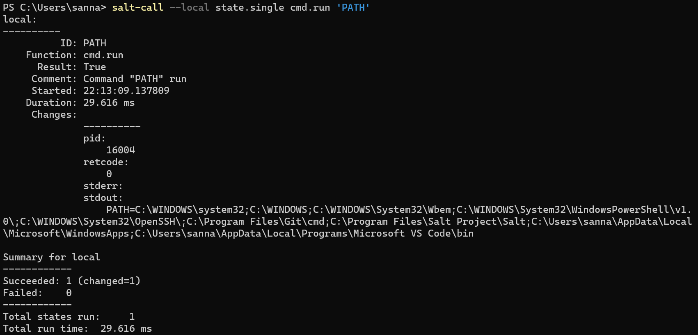

[Etusivu](index.html) 
&emsp;[H1](h1.html)
&emsp;[H2](h2.html)
&emsp;[H3](h3.html)
&emsp;[H4](h4.html)
&emsp;[H5](h5.html)
&emsp;H6
&emsp;[H7](h7.html)

# Harjoitus 6 - Akkuna

```
Nimi              Sanna Jyrinki
Oppilaitos        Haaga-Helian ammattikorkeakoulu
Kurssi            Palvelinten hallinta ICT4TN022-3015
Opettaja          Tero Karvinen
Tietokoneena      AMD Ryzen 5 PRO 4650U with Radeon Graphics 2.10 GHz
Käyttöjärjestelmä Windows 11 Pro, Versio 21H2
Linux             Oracle Virtual Box 6.1, Debian 11.3
```

## Lähteet

Karvinen, T. 2018. Control Windows with Salt. Luettavissa [https://terokarvinen.com/2018/04/18/control-windows-with-salt/](https://terokarvinen.com/2018/04/18/control-windows-with-salt/). Luettu 6.5.2022.

## Tehtävä v, Lue ja tiivistä

### Karvinen 2018: [Control Windows with Salt](https://terokarvinen.com/2018/04/18/control-windows-with-salt/).

- artikkeli kuvaa miten windowsista tehdään salt-orja asentamalla salt-minion
- windows salt-orjaa voidaan käskyttää joko lokaalisti tai ubuntu salt-masterilla
- asennetaan esim. gedit,firefox,steam,vlc
- Chocolateyn kautta voi asentaa windowsille saltilla vielä enemmän sovelluksia

## Tehtävä a,  Suolaikkuna

Asensin Saltin tunnilla windowsiiin, mutta poistin sen, jotta sain kokeiltua uudelleen.

Asennan Salt-minionin, asennustiedoston löydän [täältä](https://repo.saltproject.io/#windows).
Valitsin AMD64 version exe-asennuspaketilla.


Asennus onnistui, ja valitse, että minion käynnistyy.


Testaan salt asennuksen käynnistämällä powershellin järjestelmävalvojana, joka valinta löytyy windows+X takaa avautuvasta valikosta. Ajan muutaman lokaalin salt käskyn:


## Tehtävä b, Single

Testaan saltia powershellin komentoriviltä

Ajan käskyn PATH, joka tulostaa PATH ympäristömuuttujan sisällön eli polut, jotka löytyvät windowsin pathista


Teen saltilla uuden hakemiston Temp C-levyn juureen


Tässä näkyy muodostunut hakemisto ja sen luontipäivänä on tämä päivä ja kellonaika, jolloin suunnilleen ajoin käskyn:


## Tehtävä c, IaCcuna

Tein ensin tilan foo, mutten tiennyt mihin se piti windowsissa laittaa. Kokeilin laittaa C:\Temp\foo\init.sls. Tiedosto oli tässä vaiheessa vain yksinkertainen, koska halusin onnistua ylipäätään ajamaan sen saltin tilana.
```
'echo moi':
  cmd.run 
```

Yritin ajaa C:\Temp hakemistossa, mutta sain virheilmoituksen.
```
PS C:\Temp> salt-call --local state.apply foo
local:
    Data failed to compile:
----------
    No matching sls found for 'foo' in env 'base'
```

Aikani pähkäiltyäni ja kokeiltuani eri hakemistoja ja googleteltua tuloksetta lisäsin käskyn lokitasoa ja se kertoi mistä saltin hakemisto löytyy:
```
PS C:\Temp> salt-call --local -l debug state.apply
...
[DEBUG   ] No contents found in top file. If this is not expected, verify that the 'file_roots' specified in 'etc/master' are accessible. The 'file_roots' configuration is: {'base': ['C:\\ProgramData\\Salt Project\\Salt\\srv\\salt', 'C:\\ProgramData\\Salt Project\\Salt\\srv\\spm\\salt']}
```

Kopioin foo/init.sls:n hakemistoon `C:\\ProgramData\\Salt Project\\Salt\\srv\\salt`

Kokeilin ajaa nyt uudelleen ja toimii
```
PS C:\Temp> salt-call --local state.apply foo
local:
----------
          ID: echo moi
    Function: cmd.run
      Result: True
     Comment: Command "echo moi" run
     Started: 22:32:30.248008
    Duration: 25.141 ms
     Changes:
              ----------
              pid:
                  6196
              retcode:
                  0
              stderr:
              stdout:
                  moi

Summary for local
------------
Succeeded: 1 (changed=1)
Failed:    0
------------
Total states run:     1
Total run time:  25.141 ms
```

Teen tilaan infraa koodina eli pkg - file - service. Yritin aloittaa asennuksesta, mutta mikää asennus ei onnistunut, vaan kaikille sain virheen samanlaisen virheen.

```
PS C:\Temp> salt-call --local state.apply foo
[ERROR   ] Unable to locate package gedit
[ERROR   ] {'gedit': 'Unable to locate package gedit'}
local:
----------
          ID: gedit
    Function: pkg.installed
      Result: False
     Comment: The following packages failed to install/update: gedit
     Started: 22:49:54.622231
    Duration: 235.628 ms
     Changes:
              ----------
              gedit:
                  Unable to locate package gedit

Summary for local
------------
Succeeded: 0 (changed=1)
Failed:    1
------------
Total states run:     1
Total run time: 235.628 ms
```

En osaa ratkaista tätä.

## Tehtävä e, Goal

Tein projektilleni palautussivun osoitteeseen https://github.com/jyrinsan/hh_saltproject. Osoitteesta löytyy raportti (README.md) sekä itse moduuli srv/salt hakemistosta.

Miniprojektini aiheena on tehdä lähinnä omaan käyttöön moduuli, joka asentaa/konfiguroi ympäristön kehittää Django-webbisovellus apachelle, sekä niihin liittyvät kilkkeet/työkalut kuten editori, palomuuri ja muuta mieleen tulevaa. Tarkoituksena asentaa nopeasti uudelle linuxille (virtuaalikone pilvessä, virtuaalikone VirtualBoxissa, tai oma Linux-kone) nopeasti ympäristö ja aloittaa siinä uuden sovellus kehitys webbisovellukseksi.

Moduulini lisenssiksi valitsen [GPL2 lisenssin](https://opensource.org/licenses/gpl-2.0.php), koska haluan tehdä vapaan koodin, joka on vapaasti kopioitavissa, muokattavissa ja jatkokehitettävissä.

Ensimmäisessä alphaversiossa teen salt-tilan, joka asentaa micro-tekstieditorin, ufw-palomuurin sekä apachen peruskonfiguroinneilla (apachen testisivu + käyttäjän kotisivu). 