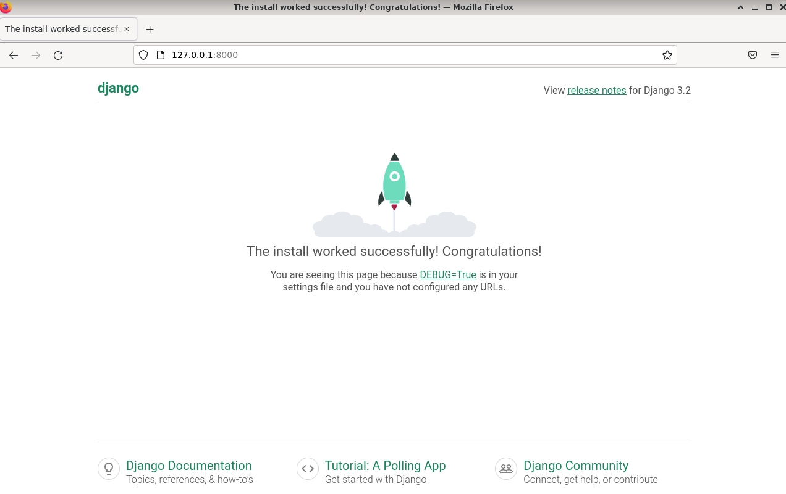
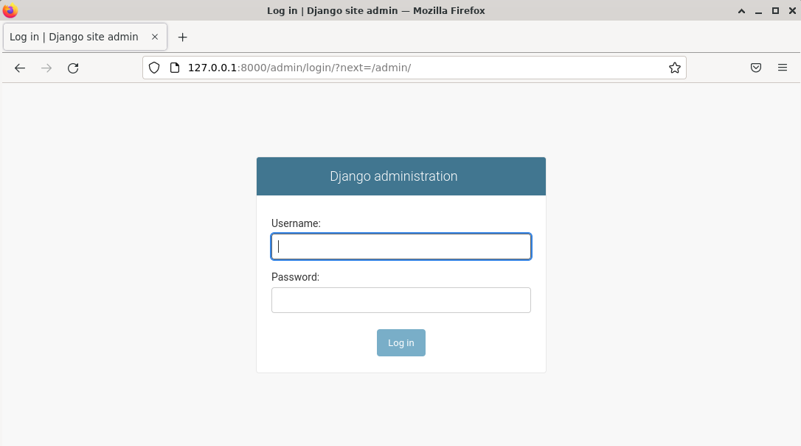
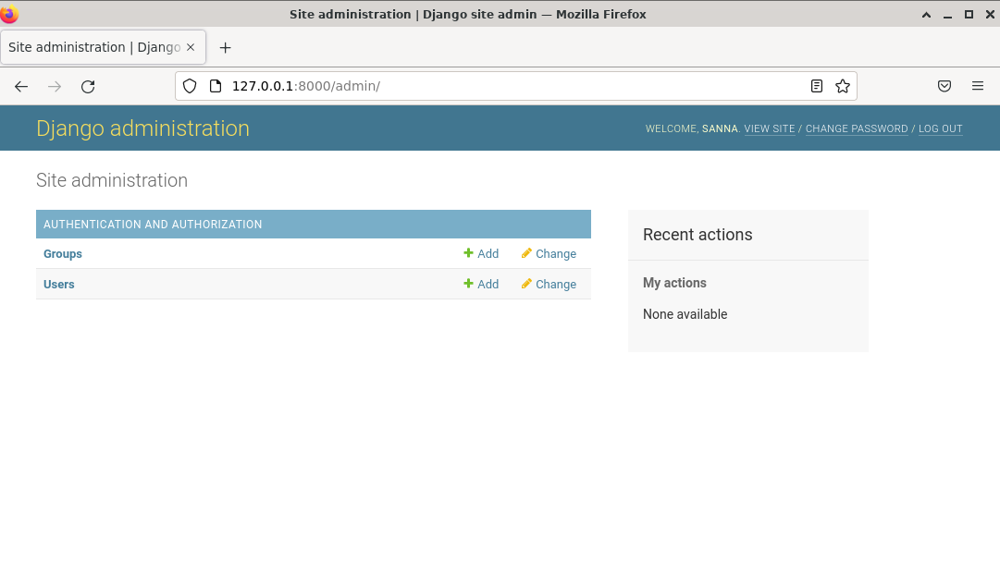
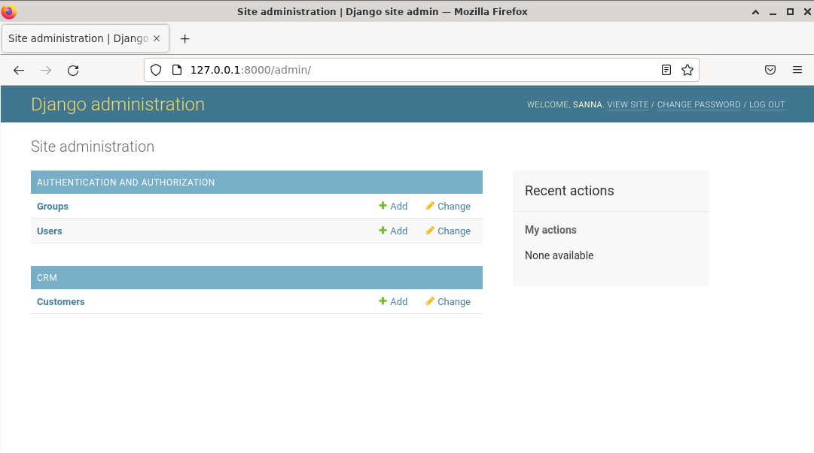
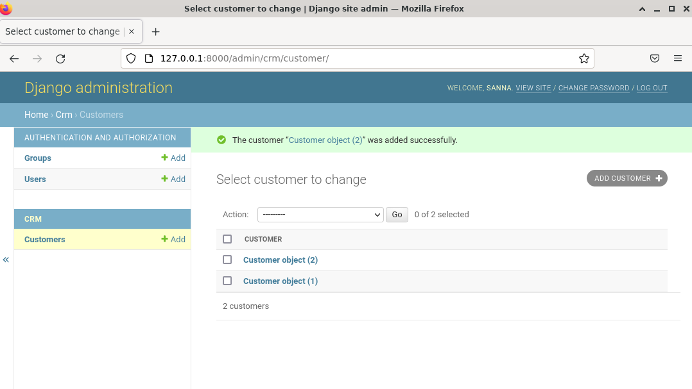
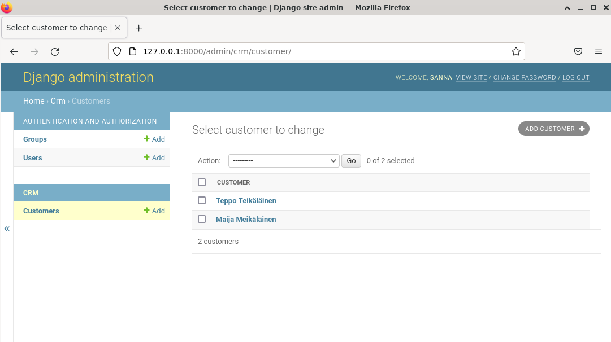
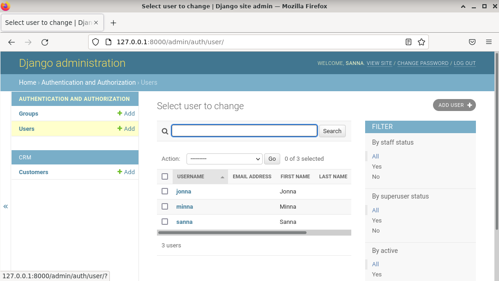
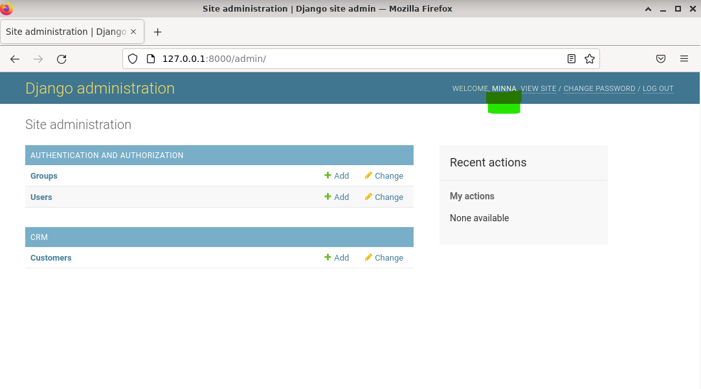

[Etusivu](index.html) 
&emsp;PW1
&emsp;[PW2](pw2.html)
&emsp;[PW3](pw3.html)
&emsp;[PW4](pw4.html)
&emsp;[PW5](pw5.html)
&emsp;[PW6](pw6.html)

# Harjoitus 1 - Hello DJ A

```
Nimi              Sanna Jyrinki
Oppilaitos        Haaga-Helian ammattikorkeakoulu
Kurssi            Python weppipalvelu - ideasta tuotantoon ICT8TN034-3002
Opettaja          Tero Karvinen
Tietokoneena      AMD Ryzen 5 PRO 4650U with Radeon Graphics 2.10 GHz
Käyttöjärjestelmä Windows 11 Pro, Versio 21H2
Linux             Oracle Virtual Box 6.1, Debian 11.3
```

## Lähteet

Karvinen, T. 2022a. Python Web Service From Idea to Production. Luettavissa [https://terokarvinen.com/2021/python-web-service-from-idea-to-production-2022/](https://terokarvinen.com/2021/python-web-service-from-idea-to-production-2022/). Luettu 23.5.2022.

Karvinen, T. 2022b. Django 4 Instant Customer Database Tutorial. Luettavissa [https://terokarvinen.com/2022/django-instant-crm-tutorial/](https://terokarvinen.com/2022/django-instant-crm-tutorial/). Luettu 23.5.2022.

## a) Asenna Django-kehitysympäristö.

Pohjana tehtävissä on Tero Karvisen kurssi (Karvinen, 2022a) sekä Django ohje (Karvinen, 2022b).

Ensin loin kotihakemistooni alihakemiston django-asennukselle
<pre><font color="#55FF55"><b>sanna@sanna-virtualbox</b></font>:<font color="#5555FF"><b>~</b></font>$ pwd
/home/sanna
<font color="#55FF55"><b>sanna@sanna-virtualbox</b></font>:<font color="#5555FF"><b>~</b></font>$ mkdir django
<font color="#55FF55"><b>sanna@sanna-virtualbox</b></font>:<font color="#5555FF"><b>~</b></font>$ cd django
</pre>

Asensin virtualenv paketin paketinhallinnasta
<pre><font color="#55FF55"><b>sanna@sanna-virtualbox</b></font>:<font color="#5555FF"><b>~/django</b></font>$ sudo apt-get -y install virtualenv
</pre>

Loin uuden virtualenv:n nimeltään env. 
<pre><font color="#55FF55"><b>sanna@sanna-virtualbox</b></font>:<font color="#5555FF"><b>~/django</b></font>$ virtualenv --system-site-packages -p python3 env</pre>

Otin käyttöön uuden env-ympäristön ja tarkistin, että python löytyy luodusta virtualenv:stä eikä debianin oletussijainnista. Djangon asennuksessa on tarkoitus käyttää pythonia nimenomaan asennetun virtualenvin sisältä.
<pre><font color="#55FF55"><b>sanna@sanna-virtualbox</b></font>:<font color="#5555FF"><b>~/django</b></font>$ source env/bin/activate
(env) <font color="#55FF55"><b>sanna@sanna-virtualbox</b></font>:<font color="#5555FF"><b>~/django</b></font>$ which pip
/home/sanna/django/env/bin/pip
</pre>

Teen `requirements.txt` tiedoston, jossa määrittelen, mitä haluan pip-käskyn asentavan. Haluan asentaa Djangon 3.2 version. Suoritan myös djangon asennuksen. 
<pre>env) <font color="#55FF55"><b>sanna@sanna-virtualbox</b></font>:<font color="#5555FF"><b>~/django</b></font>$ cat requirements.txt 
django==3.2
(env) <font color="#55FF55"><b>sanna@sanna-virtualbox</b></font>:<font color="#5555FF"><b>~/django</b></font>$ pip install -r requirements.txt
</pre>

Tarkistan, että djangosta asentui haluamani versio
<pre>(env) <font color="#55FF55"><b>sanna@sanna-virtualbox</b></font>:<font color="#5555FF"><b>~/django</b></font>$ django-admin --version
3.2
</pre>

Perustan projektiksi tulevan webbisaittini `jyrinki.com`. Huomaan alla kuitenkin, ettei projektin nimessä saa olla pisteitä, joten muutan sen `jyrinkicom` muotoon. 
<pre>(env) <font color="#55FF55"><b>sanna@sanna-virtualbox</b></font>:<font color="#5555FF"><b>~/django</b></font>$ django-admin startproject jyrinki.com
<font color="#FF5555"><b>CommandError: &apos;jyrinki.com&apos; is not a valid project name. Please make sure the name is a valid identifier.</b></font>
(env) <font color="#55FF55"><b>sanna@sanna-virtualbox</b></font>:<font color="#5555FF"><b>~/django</b></font>$ django-admin startproject jyrinkicom
</pre>

Syntyi hakemisto
<pre>
(env) <font color="#55FF55"><b>sanna@sanna-virtualbox</b></font>:<font color="#5555FF"><b>~/django</b></font>$ tree jyrinkicom
<font color="#5555FF"><b>jyrinkicom</b></font>
├── <font color="#5555FF"><b>jyrinkicom</b></font>
│   ├── asgi.py
│   ├── __init__.py
│   ├── settings.py
│   ├── urls.py
│   └── wsgi.py
└── <font color="#55FF55"><b>manage.py</b></font>
</pre>

Käynnistän kehitysserverin, tulee varoitus ettei migraatioita ole tehty.
<pre>(env) <font color="#55FF55"><b>sanna@sanna-virtualbox</b></font>:<font color="#5555FF"><b>~/django/jyrinkicom</b></font>$ ./manage.py runserver
Watching for file changes with StatReloader
Performing system checks...

System check identified no issues (0 silenced).

<font color="#AA0000">You have 18 unapplied migration(s). Your project may not work properly until you apply the migrations for app(s): admin, auth, contenttypes, sessions.</font>
<font color="#AA0000">Run &apos;python manage.py migrate&apos; to apply them.</font>
May 23, 2022 - 12:04:34
Django version 3.2, using settings &apos;jyrinkicom.settings&apos;
Starting development server at http://127.0.0.1:8000/
</pre>

Djangon testisivu käynnistyy kuitenkin ko. urlin osoitteessa
<kbd></kbd>

Ajan migraatiot. Migraatiot muokkaavat djangon tietokannan mallien(models) mukaiseksi.
<pre>(env) <font color="#55FF55"><b>sanna@sanna-virtualbox</b></font>:<font color="#5555FF"><b>~/django/jyrinkicom</b></font>$ ./manage.py makemigrations
No changes detected
(env) <font color="#55FF55"><b>sanna@sanna-virtualbox</b></font>:<font color="#5555FF"><b>~/django/jyrinkicom</b></font>$ ./manage.py migrate
<font color="#55FFFF"><b>Operations to perform:</b></font>
<b>  Apply all migrations: </b>admin, auth, contenttypes, sessions
<font color="#55FFFF"><b>Running migrations:</b></font>
  Applying contenttypes.0001_initial...<font color="#55FF55"><b> OK</b></font>
  Applying auth.0001_initial...<font color="#55FF55"><b> OK</b></font>
  Applying admin.0001_initial...<font color="#55FF55"><b> OK</b></font>
  Applying admin.0002_logentry_remove_auto_add...<font color="#55FF55"><b> OK</b></font>
  Applying admin.0003_logentry_add_action_flag_choices...<font color="#55FF55"><b> OK</b></font>
  Applying contenttypes.0002_remove_content_type_name...<font color="#55FF55"><b> OK</b></font>
  Applying auth.0002_alter_permission_name_max_length...<font color="#55FF55"><b> OK</b></font>
  Applying auth.0003_alter_user_email_max_length...<font color="#55FF55"><b> OK</b></font>
  Applying auth.0004_alter_user_username_opts...<font color="#55FF55"><b> OK</b></font>
  Applying auth.0005_alter_user_last_login_null...<font color="#55FF55"><b> OK</b></font>
  Applying auth.0006_require_contenttypes_0002...<font color="#55FF55"><b> OK</b></font>
  Applying auth.0007_alter_validators_add_error_messages...<font color="#55FF55"><b> OK</b></font>
  Applying auth.0008_alter_user_username_max_length...<font color="#55FF55"><b> OK</b></font>
  Applying auth.0009_alter_user_last_name_max_length...<font color="#55FF55"><b> OK</b></font>
  Applying auth.0010_alter_group_name_max_length...<font color="#55FF55"><b> OK</b></font>
  Applying auth.0011_update_proxy_permissions...<font color="#55FF55"><b> OK</b></font>
  Applying auth.0012_alter_user_first_name_max_length...<font color="#55FF55"><b> OK</b></font>
  Applying sessions.0001_initial...<font color="#55FF55"><b> OK</b></font>
</pre>

Loin superuserin, jotta päästään kirjautumaan admin-käyttöliittymään
<pre>(env) <font color="#55FF55"><b>sanna@sanna-virtualbox</b></font>:<font color="#5555FF"><b>~/django/jyrinkicom</b></font>$ pwgen -s 20 1

(env) <font color="#55FF55"><b>sanna@sanna-virtualbox</b></font>:<font color="#5555FF"><b>~/django/jyrinkicom</b></font>$ ./manage.py createsuperuser
Username (leave blank to use &apos;sanna&apos;): 
Email address: 
Password: 
Password (again): 
Superuser created successfully.
</pre>

Käynnistän uudelleen kehitysserverin (./manage.py runserver) ja kirjaudun admin käyttöliittymään laittamalla urlin perään /admin.

<kbd></kbd>
<kbd></kbd>

## b) Lisää omia kenttiä malliin.

Lisään oman sovelluksen `crm`
<pre>(env) <font color="#55FF55"><b>sanna@sanna-virtualbox</b></font>:<font color="#5555FF"><b>~/django/jyrinkicom</b></font>$ ./manage.py startapp crm
(env) <font color="#55FF55"><b>sanna@sanna-virtualbox</b></font>:<font color="#5555FF"><b>~/django/jyrinkicom</b></font>$ tree crm
<font color="#5555FF"><b>crm</b></font>
├── admin.py
├── apps.py
├── __init__.py
├── <font color="#5555FF"><b>migrations</b></font>
│   └── __init__.py
├── models.py
├── tests.py
└── views.py

1 directory, 7 files
</pre>

Lisään jyrinkicom/settings.py tiedostoon sovelluksen nimi `crm` asennetuihin sovelluksiin viimeiseksi riviksi.
```
...
INSTALLED_APPS = [
    'django.contrib.admin',
    'django.contrib.auth',
    'django.contrib.contenttypes',
    'django.contrib.sessions',
    'django.contrib.messages',
    'django.contrib.staticfiles',
    'crm',
]
...
```

Muokkaan sovelluksen tietokantamalliin `crm/models.py` yhden taulun Customer
<pre>(env) <font color="#55FF55"><b>sanna@sanna-virtualbox</b></font>:<font color="#5555FF"><b>~/django/jyrinkicom</b></font>$ cat crm/models.py 
from django.db import models

class Customer(models.Model):
	name = models.CharField(max_length=300)
</pre>

Ajan migraatiot, jotta malli siirtyy tietokannan tauluksi.
<pre>env) <font color="#55FF55"><b>sanna@sanna-virtualbox</b></font>:<font color="#5555FF"><b>~/django/jyrinkicom</b></font>$ ./manage.py makemigrations
<font color="#55FFFF"><b>Migrations for &apos;crm&apos;:</b></font>
  <b>crm/migrations/0001_initial.py</b>
    - Create model Customer
(env) <font color="#55FF55"><b>sanna@sanna-virtualbox</b></font>:<font color="#5555FF"><b>~/django/jyrinkicom</b></font>$ ./manage.py migrate
<font color="#55FFFF"><b>Operations to perform:</b></font>
<b>  Apply all migrations: </b>admin, auth, contenttypes, crm, sessions
<font color="#55FFFF"><b>Running migrations:</b></font>
  Applying crm.0001_initial...<font color="#55FF55"><b> OK</b></font>
</pre>

Rekisteröin tietokannan muokkaamalla `crm/admin.py`, jotta se näkyy admin-käyttöliittymässä
<pre>(env) <font color="#55FF55"><b>sanna@sanna-virtualbox</b></font>:<font color="#5555FF"><b>~/django/jyrinkicom</b></font>$ cat crm/admin.py 
from django.contrib import admin
from . import models

admin.site.register(models.Customer)
</pre>

Testaan
<kbd></kbd>

Lisään muutaman testiasiakkaan
<kbd></kbd>

Muokkaan vielä mallia, niin että asiakkaan nimet tulostuvat listaan
<pre><font color="#55FF55"><b>sanna@sanna-virtualbox</b></font>:<font color="#5555FF"><b>~/django/jyrinkicom/crm</b></font>$ cat models.py 
from django.db import models

class Customer(models.Model):
	name = models.CharField(max_length=300)
	email = models.EmailField(default=&quot;&quot;)
	premium = models.BooleanField(default=False)
	

	def __str__(self):
		return self.name
</pre>

Ajan taas migraatiot ja testaan, että muutos näkyy käyttöliittymässä
<kbd></kbd>

## c) Tee lisää käyttäjiä, jotka saavat kirjautua Djangon adminiin

Tein admin-käyttöliittymän Users-Add toiminnolla vielä 2 uutta käyttäjää minna ja jonna, säädän kaikille käyttäjille superuser oikeudet
<kbd></kbd>

Kirjauduin sisään minnana ja onnistuu, yläpalkissa näkyy kirjautuneen käyttäjän tunnuksena minna
<kbd></kbd>