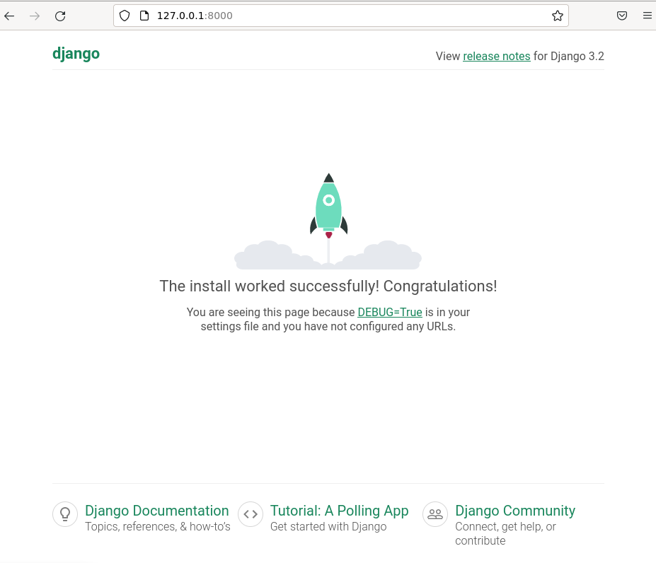
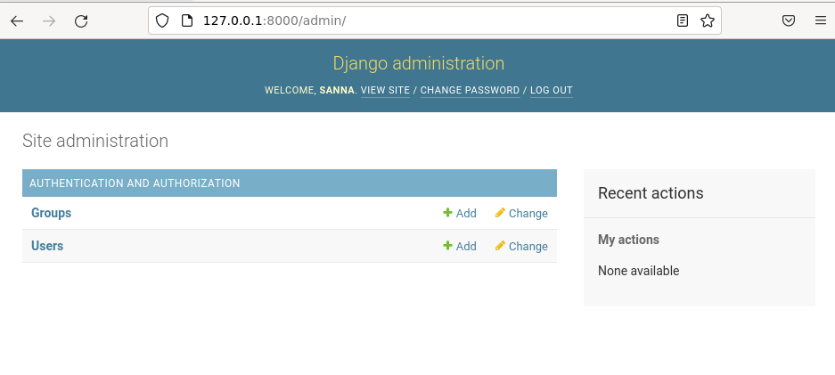
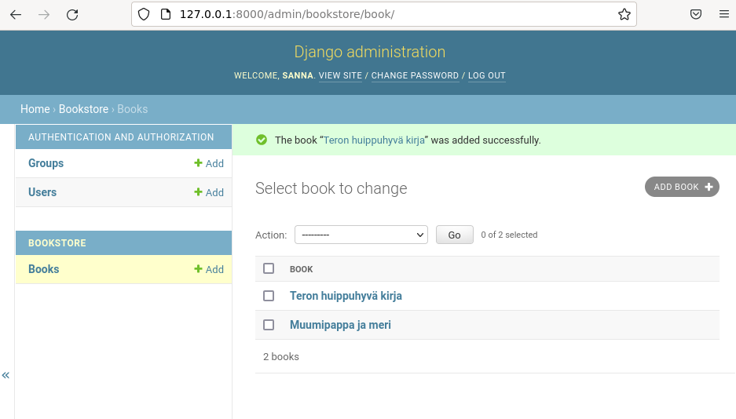
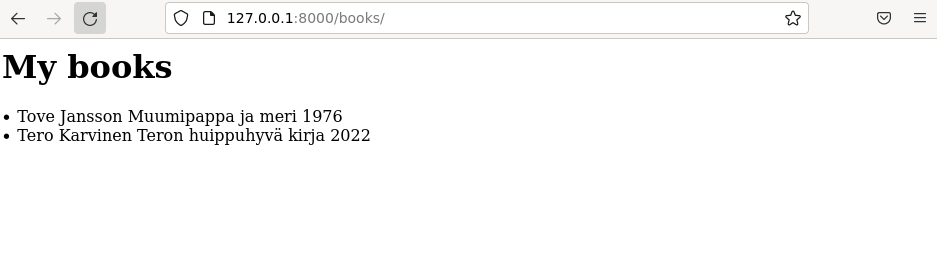

[Etusivu](index.html) 
&emsp;[PW1](pw1.html)
&emsp;PW2
&emsp;[PW3](pw3.html)
&emsp;[PW4](https://github.com/jyrinsan/pythonwebbipalvelu/tree/master/pw4)
&emsp;[PW5](pw5.html)
&emsp;[PW6](pw6.html)

# Harjoitus 2 - ListView

```
Nimi              Sanna Jyrinki
Oppilaitos        Haaga-Helian ammattikorkeakoulu
Kurssi            Python weppipalvelu - ideasta tuotantoon ICT8TN034-3002
Opettaja          Tero Karvinen
Tietokoneena      AMD Ryzen 5 PRO 4650U with Radeon Graphics 2.10 GHz
Käyttöjärjestelmä Windows 11 Pro, Versio 21H2
Linux             Oracle Virtual Box 6.1, Debian 11.3
```

## Lähteet

Django Contributors. n.a. Model field reference. Luettavissa [https://docs.djangoproject.com/en/3.2/ref/models/fields/#field-types](https://docs.djangoproject.com/en/3.2/ref/models/fields/#field-types). Luettu 24.5.2022. 

Karvinen, T. 2022a. Python Web Service From Idea to Production. Luettavissa [https://terokarvinen.com/2021/python-web-service-from-idea-to-production-2022/](https://terokarvinen.com/2021/python-web-service-from-idea-to-production-2022/). Luettu 23.5.2022.

Karvinen, T. 2022b. Django 4 Instant Customer Database Tutorial. Luettavissa [https://terokarvinen.com/2022/django-instant-crm-tutorial/](https://terokarvinen.com/2022/django-instant-crm-tutorial/). Luettu 23.5.2022.

MDN Contributors. n.a. Django Tutorial Part 3: Using models. Luettavissa [https://developer.mozilla.org/en-US/docs/Learn/Server-side/Django/Models](https://developer.mozilla.org/en-US/docs/Learn/Server-side/Django/Models). Luettu 24.5.2022.

## a) Uusi django-projekti

Tehtävänanto löytyy Tero Karvisen kurssimateriaalista (Karvinen, 2022a).

### django-asennus
Asensin django ympäristön samaan tapaan kuin edellisessä tehtävässä [pw1](pw1.html).

Loin kotihakemistossani hakemiston uudelle projektille `bookstore`
```bash
cd
mkdir bookstore
cd bookstore
```

Loin env-virtuaaliympäristön
```bash
virtualenv --system-site-packages -p python3 env
source env/bin/activate
which pip # tarkastetaan, että polku env:n sisällä
```

Asensin djangon 
```bash
micro requirements.txt # sisällöksi django==3.2
pip install -r requirements.txt
django-admin --version # tarkistetaan asennus
```

Loin django-projektin, ajoin migraatiot, loin superuserin
```bash
django-admin startproject jyrinkicom
cd jyrinki.com
./manage.py makemigrations
./manage.py migrate 
pwgen -s 20 1
/manage.py createsuperuser
```

Käynnistin serverin `./manage.py runserver`

Testasin djangon testisivun `http://127.0.0.1:8000` selaimella 
<kbd></kbd>
 
Testasin djangon admin-sivun `http://127.0.0.1:8000/admin` selaimella
<kbd></kbd>

### bookstore sovellus

Loin `bookstore` sovelluksen
```bash
./manage.py startapp bookstore
micro jyrinkicom/settings.py # lisätään sovellus INSTALLED_APPS kohtaan
```

Loin kantamallin `micro bookstore/models.py`. Sovelluksessa luodaan kirjoja, joilla on nimi, kirjailija ja julkaisuvuosi.
```python
from django.db import models

class Book(models.Model):
	name = models.CharField(max_length=300)
	author = models.CharField(max_length=300)
	pubYear = models.IntegerField()

	def __str__(self):
		return self.name
```

Ajoin migraatiot, joka tekee mallin mukaan tietokantamuutokset
```bash
./manage.py makemigrations
./manage.py migrate
```

Rekisteröin tietokannan `micro bookstore/admin.py`, jotta django tunnistaa sen
```python
from django.contrib import admin
from . import models

admin.site.register(models.Book)
```

Testatasin lisätä pari kirjaa admin-käyttöliittymällä
<kbd></kbd>

### webbisivu 

Webbisivun teko koostui kolmesta osasta:
- sivun url-polun lisäys urls.py tiedostoon
- sivun listanäkymän määrittely views.py tiedostoon
- sivun ulkoasun teko html-template pohjana

Määrittelin polun sivulle `micro jyrinki.com/urls.py` lisäämällä pathin books
```python
from django.contrib import admin
from django.urls import path
from bookstore import views

urlpatterns = [
    path('admin/', admin.site.urls),
    path('books/', views.BookListView.as_view())
]
```

Määrittelin kirja-näkymälle ListView:n `micro bookstore/views.py`. Django näyttää nyt pathin polussa Book-modelin kirjoja.
```python
from django.views.generic import ListView
from . import models

class BookListView(ListView):
	model = models.Book
```

Tein hakemistpm html-sivulle (template)
```bash
mkdir bookstore/templates
mkdir bookstore/templates/bookstore
```

Loin html-templaten `micro bookstore/templates/bookstore/book_list.html`
```python
<h1>My books</h1>


    <li>{{ book.author }}
	    {{ book.name }}
	    {{ book.pubYear }} </li>

```

Restarttaan kehitysserverin `./managepy runserver`

Lopussa vielä testasin toimiiko sivu (testasin kyllä jo aiemmin aina muutos kerrallaan, mutta tässä lopputulos testattuna)

<kbd></kbd>
