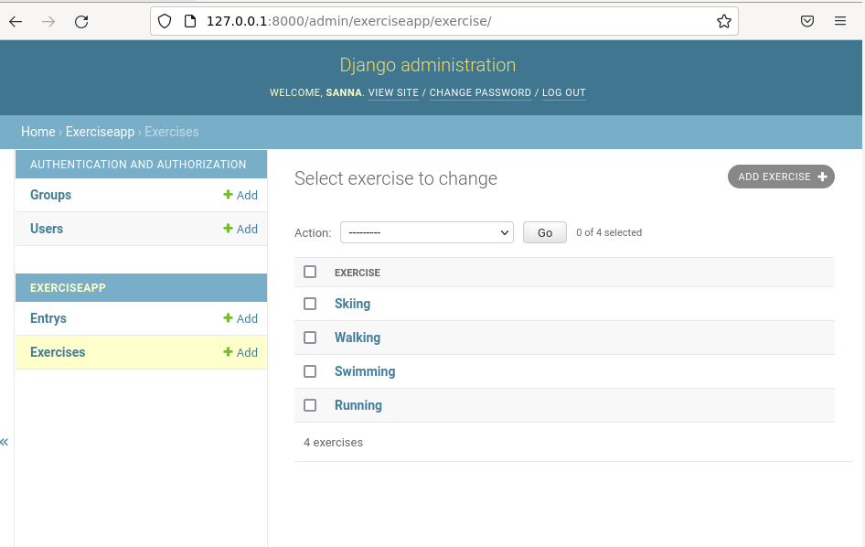
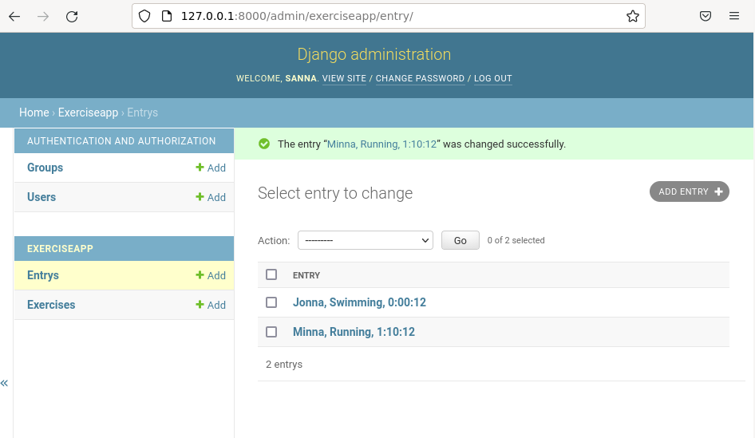
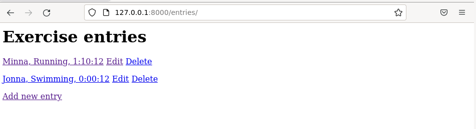
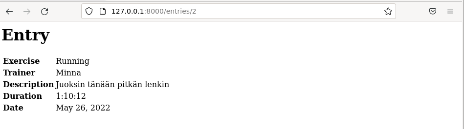
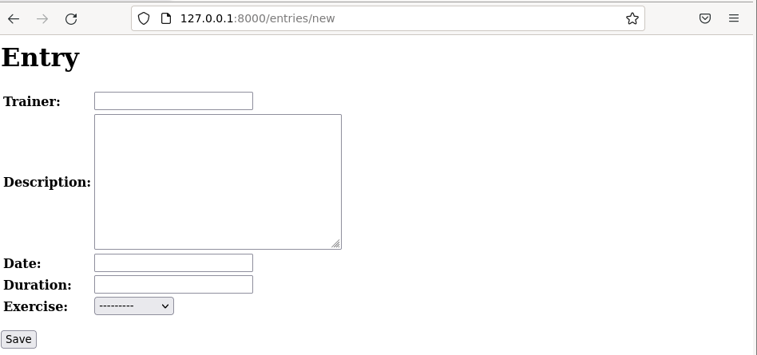
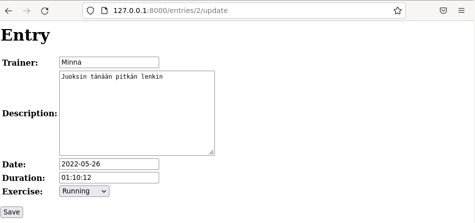
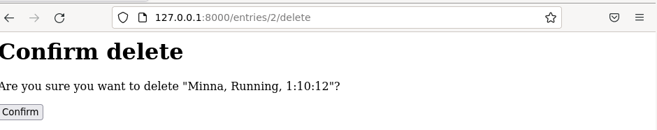

[Etusivu](index.html) 
&emsp;[PW1](pw1.html)
&emsp;[PW2](pw2.html)
&emsp;PW3
&emsp;[PW4](pw4.html)
&emsp;[PW5](pw5.html)
&emsp;[PW6](pw6.html)

# Harjoitus 3 - CRUD

```
Nimi              Sanna Jyrinki
Oppilaitos        Haaga-Helian ammattikorkeakoulu
Kurssi            Python weppipalvelu - ideasta tuotantoon ICT8TN034-3002
Opettaja          Tero Karvinen
Tietokoneena      AMD Ryzen 5 PRO 4650U with Radeon Graphics 2.10 GHz
Käyttöjärjestelmä Windows 11 Pro, Versio 21H2
Linux             Oracle Virtual Box 6.1, Debian 11.3
```

## Lähteet

Django Contributors. n.a. Model field reference. Luettavissa [https://docs.djangoproject.com/en/3.2/ref/models/fields/#field-types](https://docs.djangoproject.com/en/3.2/ref/models/fields/#field-types). Luettu 26.5.2022. 

Karvinen, T. 2022a. Python Web Service From Idea to Production. Luettavissa [https://terokarvinen.com/2021/python-web-service-from-idea-to-production-2022/](https://terokarvinen.com/2021/python-web-service-from-idea-to-production-2022/). Luettu 26.5.2022.

## a) CRUD

Tehtävänanto löytyy Tero Karvisen kurssimateriaalista (Karvinen, 2022a).

Toteutin webbisovelluksen, jolla käyttäjä voi kirjata treenisuorituksia (Entry). Sovelluksessa voi luoda (C) treenikirjauksia, sekä selata (R), muokata (U) ja poistaa (D) niitä. Valittavissa olevat treenit sijaitsevat toisessa taulussa Exercise, jotka on tallennettu admin-käyttöliittymän kautta. Entry taulusta on foreign key tähän Exercise tauluun. Vain Entry-tauluun tehdään webbikäyttöliittymästä tallennuksia. 

Loin django ympäristön, jyrinkicom projektin ja exerciseapp sovelluksen samaan tapaan kuin edellisessä tehtävässä [pw2](pw2.html).

Sovelluksen lähdekoodi löytyy [täältä](https://github.com/jyrinsan/pythonwebbipalvelu/tree/master/pw3). 

### settings.py

Sovelluksen asennuksen jälkeen muokkasin `jyrinkicom/jyrinkicom/settings.py` tiedostoon sovelluksen nimen kohtaan INSTALLED_APPS, jotta Django tietää sovelluksen olemassaolosta.

[settings.py](https://github.com/jyrinsan/pythonwebbipalvelu/blob/master/pw3/jyrinkicom/jyrinkicom/settings.py)

### model.py muokkaus

Tiedostoon `jyrinkicom/exerciseapp/models.py` muokkasin sovelluksen tietokantamallin.

[models.py](https://github.com/jyrinsan/pythonwebbipalvelu/blob/master/pw3/jyrinkicom/exerciseapp/models.py)

```python
from django.db import models

class Entry(models.Model):
	trainer = models.CharField(max_length=300)
	description = models.TextField()
	date = models.DateField();
	duration = models.DurationField()
	exercise = models.ForeignKey(
		'Exercise',
		on_delete=models.CASCADE
	)

	def __str__(self):
		return f"{self.trainer}, {self.exercise.name}, {self.duration}"

	def get_absolute_url(self):
		return f"/entries/{self.pk}"

class Exercise(models.Model):
	name = models.CharField(max_length=300)

	def __str__(self):
		return self.name
```

### admin.py muokkaus

Tiedostoon `jyrinkicom/exerciseapp/admin.py` rekisteröin models.py tiedostoon luodut mallit, jotta django tunnistaa ne
```python
from django.contrib import admin
from . import models

admin.site.register(models.Exercise)
admin.site.register(models.Entry)
```

### Testaus

Ajoin migraatiot kuten edellisessä tehtävässä ja käynnistin serverin. Testasin sovellusta admin-käyttöliittymän avulla ja lisäsin treenivaihtoehtoja ja treenikirjauksia.

<kbd></kbd>
<kbd></kbd>

### views.py

Sitten rupean tekemään webbi-käyttöliittymää, jotta käyttäjän pääsevät katsomaan, lisäämään, muokkaamaan ja poistamaan treenikirjauksia käyttöliittymältä.

Tiedostoon `jyrinkicom/exerciseapp/views.py` määrittelin näkymät, jotka tarvitaan käyttöliittymälle CRUD-toimintoja varten.
```python
from django.views.generic import ListView, DetailView, UpdateView, CreateView, DeleteView
from . import models

class EntryListView(ListView):
	model = models.Entry

class EntryDetailView(DetailView):
	model = models.Entry

class EntryUpdateView(UpdateView):
	model = models.Entry
	fields = "__all__"
	success_url = "/entries"

class EntryCreateView(CreateView):
	model = models.Entry
	fields = "__all__"
	success_url = "/entries"

class EntryDeleteView(DeleteView):
	model = models.Entry
	success_url = "/entries"
```

### muotit

Hakemistoon jyrinkicom/exerciseapp/templates/exerciseapp tallensin html-muotit jokaiselle tilanteelle

[muotit](https://github.com/jyrinsan/pythonwebbipalvelu/tree/master/pw3/jyrinkicom/exerciseapp/templates/exerciseapp)

#### entry-list.html - muotti treenikirjausten listanäkymälle

```python

<h1>Exercise entries</h1>


    <p>
    	<a href={{ entry.get_absolute_url  }}>{{ entry }}</a>
	    <a href={{ entry.get_absolute_url  }}/update>Edit</a>
	    <a href={{ entry.get_absolute_url  }}/delete>Delete</a>
    </p>

<a href="/entries/new">Add new entry</a>

```

#### entry-detail.html - muotti yksittäisen treenikirjauksen näkymälle

```python

<h1>Entry</h1>

<table>
	<tbody>
		<tr>
			<td><b>Exercise</b></td>
			<td>{{ object.exercise.name }}<td>
		</tr>
		<tr>
			<td><b>Trainer</b></td>
			<td>{{ object.trainer }}<td>
		</tr>
		<tr>
			<td><b>Description</b></td>
			<td>{{ object.description }}<td>
		</tr>
			<td><b>Duration</b></td>
			<td>{{ object.duration }}<td>
		</tr>
		<tr>
			<td><b>Date</b></td>
			<td>{{ object.date }}<td>
		</tr>
	</tbody>
</table>

```

#### entry-form.html - muotti lisäyksen ja päivityksen lomakkeelle

```python

<h1>Entry</h1>

<form method=post>
	<table><tbody align=left>{{ form }}</tbody></table>
	<p><input type=submit value=Save></p>
</form>

```

#### entry-confirm-delete.html - muotti poiston varmistusnäkymälle

```python

<h1>Confirm delete</h1>

<form method="post">
    <p>Are you sure you want to delete "{{ object }}"?</p>
    <input type="submit" value="Confirm">
</form>

```

### Testaus

Testasin näkymiä:

Listausnäkymä
<kbd></kbd>

Yksittäisen tiedon näkymä
<kbd></kbd>

Uuden kirjauksen syöttö
<kbd></kbd>

Päivitys
<kbd></kbd>

Poiston varmistus
<kbd></kbd>
