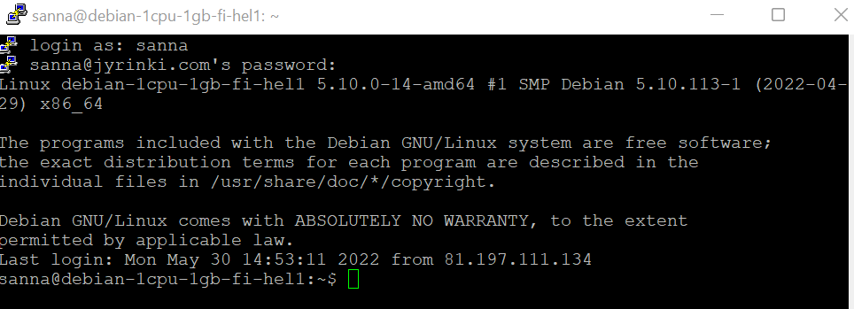
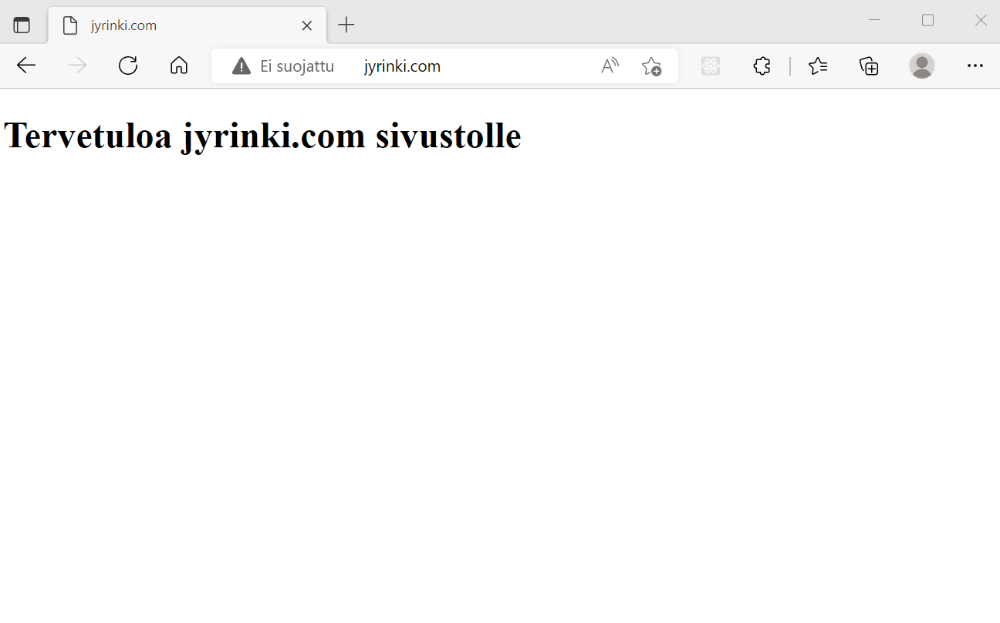
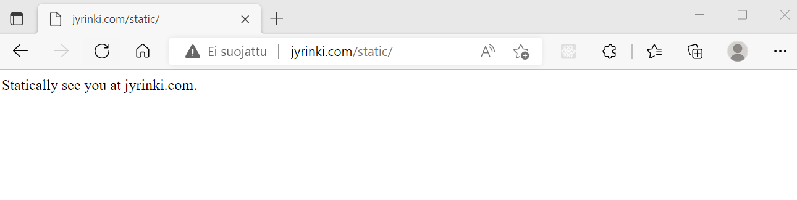
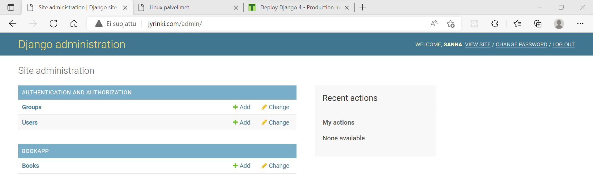
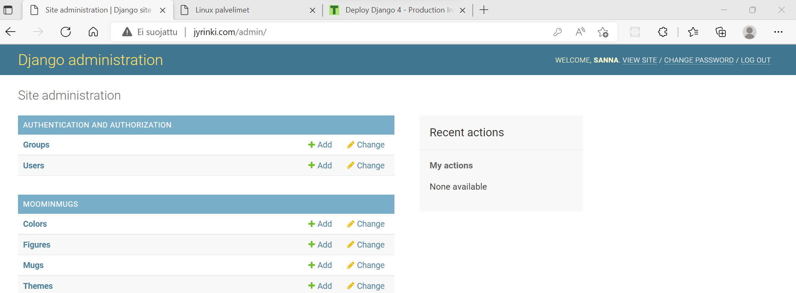
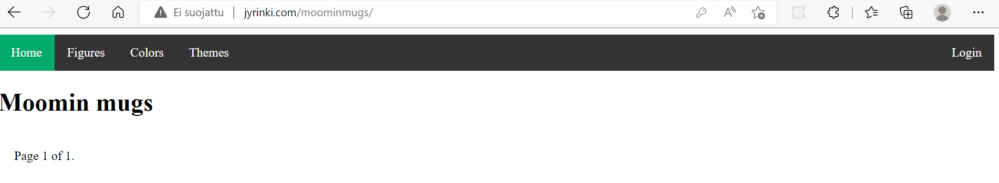

[Etusivu](index.html) 
&emsp;[PW1](pw1.html)
&emsp;[PW2](pw2.html)
&emsp;[PW3](pw3.html)
&emsp;[PW4](pw4.html)
&emsp;PW5
&emsp;[PW6](pw6.html)

# Harjoitus 5 - kone pilvestä

```
Nimi              Sanna Jyrinki
Oppilaitos        Haaga-Helian ammattikorkeakoulu
Kurssi            Python weppipalvelu - ideasta tuotantoon ICT8TN034-3002
Opettaja          Tero Karvinen
Tietokoneena      AMD Ryzen 5 PRO 4650U with Radeon Graphics 2.10 GHz
Käyttöjärjestelmä Windows 11 Pro, Versio 21H2
Linux             Oracle Virtual Box 6.1, Debian 11.3
```

# a-c) Palvelimen ja nimen vuokraus ja apachen asennus

Minulla oli jo aiemmin Linux-palvelimet kurssilla vuokrattu kone ja nimi pilvestä. Linux-kurssilla tekemäni raportti siitä löytyy [täältä](https://jyrinsan.github.io/linuxpalvelimet/h4.html). Kone oli vuokrattu [Upcloudilta](https://upcloud.com/) ja nimi [Gandilta](https://www.gandi.net/). Nimeni on jyrinki.com. Tein kuitenkin uuden debian koneen nyt, koska koneellani ei käytännössä ollut mitään. Vaihdoin gandille uuden koneen ip-numeron vastaamaan jyrinki.com nimeä.

<kbd></kbd>

Asensin palvelimelle Apache2-webbipalvelimen. [Ohjetta](https://jyrinsan.github.io/linuxpalvelimet/h3.html) löytyy Linux-palvelimet kurssin kotitehtävästä.

Tässä näkyy apachen oletussivu muokattuna. Kokeilin myös kännykällä, että sivu näkyy.
<kbd></kbd>

## d) Django-tuotantoasennus

### stattinen sivu

Käytin apuna Linux-kurssilla tekemääni [raporttia](https://jyrinsan.github.io/linuxpalvelimet/h5.html),joka perustuu Tero Karvisen [Django-ohjeeseen](https://terokarvinen.com/2022/deploy-django/?fromSearch=django).

Ensin tein staattisen sivun
<kbd></kbd>

Sen jälkeen tein djangon tuotantoasennuksen. Tein asennustestiä varten models.py:hyn luokan Book, jotta sain admin-käyttöliittymältä testattua, että kaikki toimii. Admin käyttöliittymä näkyy osoitteessa jyrinki.com/admin.

<kbd></kbd>

Seuraavaksi siirsin tuotantopalvelimelle viikonloppuna nyhertäni alustavan version miniprojektista.

Kirjauduin VirtualBoxissani olevalle Debianille, jossa on sovelluksen kehitysversio. Menin hakemistooni /home/sanna/miniprojekti/jyrinkicom. Ajoin käskyn
```
scp -r jyrinkicom/ moomimugs/ sanna@jyrinkicom:/home/sanna/publicwsgi/jyrinkicom
source 
```
Se kopioi projektin ja sovelluksen (moominmugs) hakemistot alihakemistoineen ja sisältöineen virtuaalipalvelimelle. Terolta ottamassa kuvaruutukaappauksessa oli kopioitu myös manage.py, mutta en nähnyt siihen mitään syytä.

Käynnistin virtualenvin `source publicwsgi/env/bin/activate` 

Virtuaalipalvelimen settings.py tiedostoon tekemäni tuotantopalvelimen asetukset olivat nyt vahingossa ylikirjoittuneet, joten minun pitää uudelleen määritää
```
DEBUG = False
ALLOWED_HOSTS = ["jyrinki.com"]
```
sekä myös staattisen hakemiston asetukset
```
import os
STATIC_ROOT = os.path.join(BASE_DIR, 'static/')
```

Ajoin migraation `./publicwsgi/jyrinkicom/manage.py migrate`

Jotta muutokset aktivoituu, kosketin vielä wsgi.py tiedostoa `touch /home/sanna/publicwsgi/jyrinkicom/jyrinkicom/wsgi.py`

Kirjauduin admin-käyttöliittymälle ja nyt siellä näkyy miniprojektini model aivan oikein
<kbd></kbd>

Sovellukseni osoitteessa `jyrinki.com/moominmugs` näkyy hienosti. Tuotannon tietokannassa ei ole vielä yhtään dataa tallennettuna.

<kbd></kbd>

# f) automatisointi